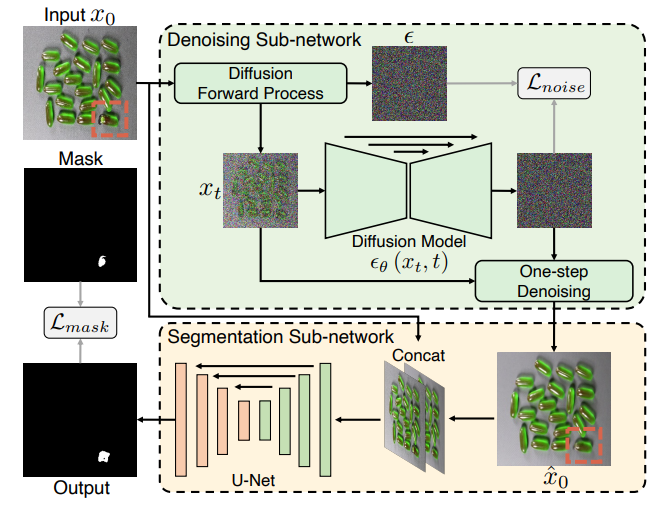

# DiffusionAD
Unofficial Re-implementation for [DiffusionAD: Denoising Diffusion for Anomaly Detection](https://arxiv.org/pdf/2303.08730v2.pdf)

# Description

Phát hiện các hạt bất thường được áp dụng rộng rãi do tính hiệu quả và hiệu suất xuất sắc của nó trong việc đáp ứng nhu cầu của sản xuất công nghiệp thực tế. Chúng tôi giới thiệu một luồng công việc mới, DiffusionAD, cho phát hiện sự bất thường. Chúng tôi đặt ra việc phát hiện sự bất thường dưới dạng một "tiến trình từ nhiễu đến chuẩn", trong đó các sự bất thường được xác định dựa trên sự không nhất quán giữa một hình ảnh truy vấn và ứng dụng hoàn hảo của nó. Luồng công việc của chúng tôi đạt được điều này bằng cách khôi phục các vùng bất thường từ hình ảnh truy vấn bị nhiễu và giữ nguyên các vùng bình thường. DiffusionAD bao gồm một mạng con loại bỏ nhiễu và một mạng con phân đoạn, cùng làm việc cùng nhau để cung cấp phát hiện và định vị sự bất thường một cách trực quan một cách liền mạch, mà không cần đến các bước xử lý sau phức tạp. Đáng kể, trong quá trình suy luận, luồng công việc này cung cấp hiệu suất đáng hài lòng chỉ với một bước quá trình ngược Diffusion, nhanh gấp hàng chục đến hàng trăm lần so với các phương pháp Diffusion tổng quát. Các đánh giá chi tiết trên các thước đo tiêu chuẩn và thách thức bao gồm VisA và DAGM cho thấy DiffusionAD vượt trội hơn so với các mô hình tiêu biểu hiện tại, chứng minh tính hiệu quả và khả năng tổng quát của luồng công việc được đề xuất.

# Environments

```
einops
kornia
torchmetrics==0.10.3
timm
```


# Process

## 1. Anomaly Simulation Strategy 

- [mvtecdataset](https://github.com/pntrungbk15/TNVision/blob/main/task/anomaly/unsupervised/data/dataset.py)
- Describable Textures Dataset(DTD) [ [download](https://www.google.com/search?q=dtd+texture+dataset&rlz=1C5CHFA_enKR999KR999&oq=dtd+texture+dataset&aqs=chrome..69i57j69i60.2253j0j7&sourceid=chrome&ie=UTF-8) ]

<p align='center'>
    
</p>

## 2. Model Process 

- [model](https://github.com/pntrungbk15/TNVision/blob/main/task/anomaly/unsupervised/models/diffusionad/model/diffusionad.py)

<p align='center'>
    
</p>

# Run

```bash
python main.py --task_type anomaly --model_type semisupervised --model_name diffusionad --yaml_config configs/anomaly/semisupervised/diffusionad/bottle.yaml
```

## Demo

### zipper
<p align="left">
  
</p>

### wood
<p align="left">
  
</p>

### transistor
<p align="left">
  
</p>

### toothbrush
<p align="left">
  
</p>

### tile
<p align="left">
  
</p>

### screw
<p align="left">
  
</p>

### pill
<p align="left">
  
</p>

### metal_nut
<p align="left">
  
</p>

### leather
<p align="left">
  
</p>

### hazelnut
<p align="left">
  
</p>

### grid
<p align="left">
  
</p>

### carpet
<p align="left">
  
</p>

### capsule
<p align="left">
  
</p>

### cable
<p align="left">
  
</p>

### bottle
<p align="left">
  
</p>

# Results

### Image-Level AUC

|                          |  Avg  | Carpet | Grid  | Leather | Tile  | Wood  | Bottle | Cable | Capsule | Hazelnut | Metal Nut | Pill  | Screw | Toothbrush | Transistor | Zipper |
| ------------------------ | :---: | :----: | :---: | :-----: | :---: | :---: | :----: | :---: | :-----: | :------: | :-------: | :---: | :---: | :--------: | :--------: | :----: |
|  | 0.000 | 0.000  | 0.000 |  0.000  | 0.000 | 0.000 | 0.000  | 0.000 |  0.000  |  0.000   |   0.000   | 0.000 | 0.000 |   0.000    |   0.000    | 0.000  |

### Pixel-Level AUC

|                          |  Avg  | Carpet | Grid  | Leather | Tile  | Wood  | Bottle | Cable | Capsule | Hazelnut | Metal Nut | Pill  | Screw | Toothbrush | Transistor | Zipper |
| ------------------------ | :---: | :----: | :---: | :-----: | :---: | :---: | :----: | :---: | :-----: | :------: | :-------: | :---: | :---: | :--------: | :--------: | :----: |
|  | 0.000 | 0.000  | 0.000 |  0.000  | 0.000 | 0.000 | 0.000  | 0.000 |  0.000  |  0.000   |   0.000   | 0.000 | 0.000 |   0.000    |   0.000    | 0.000  |

### Pixel F1 Score

|                          |  Avg  | Carpet | Grid  | Leather | Tile  | Wood  | Bottle | Cable | Capsule | Hazelnut | Metal Nut | Pill  | Screw | Toothbrush | Transistor | Zipper |
| ------------------------ | :---: | :----: | :---: | :-----: | :---: | :---: | :----: | :---: | :-----: | :------: | :-------: | :---: | :---: | :--------: | :--------: | :----: |
|  | 0.000 | 0.000  | 0.000 |  0.000  | 0.000 | 0.000 | 0.000  | 0.000 |  0.000  |  0.000   |   0.000   | 0.000 | 0.000 |   0.000    |   0.000    | 0.000  |