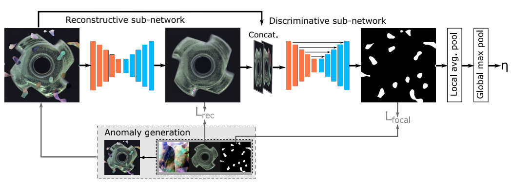

# DRAEM
Unofficial Re-implementation for [DRAEM -- A discriminatively trained reconstruction embedding for surface anomaly detection](https://arxiv.org/pdf/2108.07610.pdf)

## Description

Phát hiện dị thường trên bề mặt hình ảnh nhằm phát hiện các khu vực ảnh cục bộ mà khác biệt đáng kể so với mặt nạ bình thường. Các phương pháp mới nhất của phát hiện dị thường bề mặt dựa trên các mô hình sinh để tái tạo chính xác các khu vực bình thường và thất bại trên các vật thể dị thường. Các phương pháp này chỉ được huấn luyện trên các hình ảnh không có dị thường và thường yêu cầu các bước xử lý sau huấn luyện để xác định các vùng dị thường, điều này ngăn cản tối đa việc tối ưu hóa trích xuất đặc trưng cho khả năng phát hiện tối đa. Ngoài cách tiếp cận tái tạo, chúng tôi giải quyết vấn đề phát hiện dị thường bề mặt chủ yếu như một vấn đề phân loại và đề xuất một mô hình nhúng dị thường tái tạo được đào tạo theo hướng phân loại (DRÆM). Phương pháp đề xuất học một biểu diễn chung của hình ảnh dị thường và tái tạo bình thường của nó, đồng thời học một ranh giới quyết định giữa các ví dụ bình thường và dị thường. Phương pháp này cho phép định vị trực tiếp dị thường mà không cần các bước xử lý phức tạp bổ sung của đầu ra mạng và có thể được đào tạo bằng các mô phỏng dị thường đơn giản và tổng quát. Trên tập dữ liệu phát hiện dị thường MVTec thách thức, DRÆM vượt trội hơn so với các phương pháp không giám sát hiện tại và thậm chí cung cấp hiệu suất phát hiện gần bằng các phương pháp giám sát đầy đủ trên tập dữ liệu phát hiện lỗi bề mặt DAGM rộng dùng, đồng thời vượt trội rõ rệt về độ chính xác định vị.

# Environments

```
einops
kornia
torchmetrics==0.10.3
timm
```


# Process

## 1. Anomaly Simulation Strategy 

- [mvtecdataset](https://github.com/pntrungbk15/TNVision/blob/main/task/anomaly/semisupervised/data/dataset.py)
- Describable Textures Dataset(DTD) [ [download](https://www.google.com/search?q=dtd+texture+dataset&rlz=1C5CHFA_enKR999KR999&oq=dtd+texture+dataset&aqs=chrome..69i57j69i60.2253j0j7&sourceid=chrome&ie=UTF-8) ]

<p align='center'>
    
</p>

## 2. Model Process 

- [model](https://github.com/pntrungbk15/TNVision/blob/main/task/anomaly/semisupervised/models/draem/model/draem.py)

<p align='center'>
    
</p>

# Run

```bash
python main.py --task_type anomaly --model_type semisupervised --model_name draem --yaml_config configs/anomaly/semisupervised/draem/bottle.yaml
```

## Demo

### zipper
<p align="left">
  
</p>

### wood
<p align="left">
  
</p>

### transistor
<p align="left">
  
</p>

### toothbrush
<p align="left">
  
</p>

### tile
<p align="left">
  
</p>

### screw
<p align="left">
  
</p>

### pill
<p align="left">
  
</p>

### metal_nut
<p align="left">
  
</p>

### leather
<p align="left">
  
</p>

### hazelnut
<p align="left">
  
</p>

### grid
<p align="left">
  
</p>

### carpet
<p align="left">
  
</p>

### capsule
<p align="left">
  
</p>

### cable
<p align="left">
  
</p>

### bottle
<p align="left">
  
</p>

# Results

### Image-Level AUC

|                          |  Avg  | Carpet | Grid  | Leather | Tile  | Wood  | Bottle | Cable | Capsule | Hazelnut | Metal Nut | Pill  | Screw | Toothbrush | Transistor | Zipper |
| ------------------------ | :---: | :----: | :---: | :-----: | :---: | :---: | :----: | :---: | :-----: | :------: | :-------: | :---: | :---: | :--------: | :--------: | :----: |
|  | 0.000 | 0.000  | 0.000 |  0.000  | 0.000 | 0.000 | 0.000  | 0.000 |  0.000  |  0.000   |   0.000   | 0.000 | 0.000 |   0.000    |   0.000    | 0.000  |

### Pixel-Level AUC

|                          |  Avg  | Carpet | Grid  | Leather | Tile  | Wood  | Bottle | Cable | Capsule | Hazelnut | Metal Nut | Pill  | Screw | Toothbrush | Transistor | Zipper |
| ------------------------ | :---: | :----: | :---: | :-----: | :---: | :---: | :----: | :---: | :-----: | :------: | :-------: | :---: | :---: | :--------: | :--------: | :----: |
|  | 0.000 | 0.000  | 0.000 |  0.000  | 0.000 | 0.000 | 0.000  | 0.000 |  0.000  |  0.000   |   0.000   | 0.000 | 0.000 |   0.000    |   0.000    | 0.000  |

### Pixel F1 Score

|                          |  Avg  | Carpet | Grid  | Leather | Tile  | Wood  | Bottle | Cable | Capsule | Hazelnut | Metal Nut | Pill  | Screw | Toothbrush | Transistor | Zipper |
| ------------------------ | :---: | :----: | :---: | :-----: | :---: | :---: | :----: | :---: | :-----: | :------: | :-------: | :---: | :---: | :--------: | :--------: | :----: |
|  | 0.000 | 0.000  | 0.000 |  0.000  | 0.000 | 0.000 | 0.000  | 0.000 |  0.000  |  0.000   |   0.000   | 0.000 | 0.000 |   0.000    |   0.000    | 0.000  |