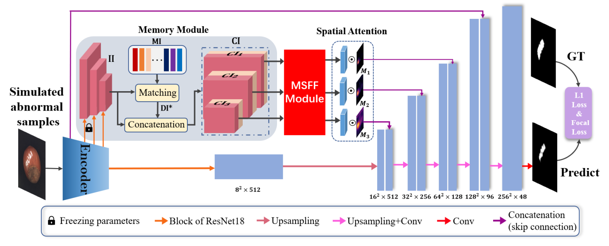

# MemSeg
Unofficial Re-implementation for [MemSeg: A semi-supervised method for image surface defect detection using differences and commonalities](https://arxiv.org/abs/2205.00908)

# Description

Dưới khung nhìn bán giám sát, chúng tôi đề xuất một mạng phân đoạn dựa trên bộ nhớ kết thúc-đầu (MemSeg) để phát hiện các khuyết tật bề mặt trên sản phẩm công nghiệp. Xem xét độ phân tán nhỏ của các sản phẩm cùng loại trong cùng dây chuyền sản xuất, từ quan điểm khác biệt và điểm chung, MemSeg giới thiệu các mẫu bất thường được mô phỏng nhân tạo và các mẫu nhớ để hỗ trợ quá trình học của mạng. Trong giai đoạn huấn luyện, MemSeg tường minh học các khác biệt tiềm năng giữa hình ảnh bình thường và hình ảnh bất thường được mô phỏng để đạt được siêu phẳng phân loại chắc chắn. Đồng thời, lấy cảm hứng từ cơ chế của bộ nhớ con người, MemSeg sử dụng một bể nhớ để lưu trữ các mẫu chung của các mẫu bình thường. Bằng cách so sánh sự tương đồng và khác biệt giữa các mẫu đầu vào và các mẫu nhớ trong bể nhớ để đưa ra dự đoán hiệu quả về các vùng bất thường; Trong giai đoạn suy luận, MemSeg xác định trực tiếp các vùng bất thường của hình ảnh đầu vào theo cách kết thúc-đầu. Thông qua xác nhận thực nghiệm, MemSeg đạt được hiệu suất tốt nhất (SOTA) trên các tập dữ liệu MVTec AD với điểm AUC của cấp ảnh và cấp điểm lần lượt là 99,56% và 98,84%. Ngoài ra, MemSeg cũng có lợi thế đáng kể về tốc độ suy luận nhờ cấu trúc mạng kết thúc-đầu và trực tiếp, tốt hơn đáp ứng yêu cầu thời gian thực trong các ứng dụng công nghiệp.


# Environments

```
einops
kornia
torchmetrics==0.10.3
timm
```


# Process

## 1. Anomaly Simulation Strategy 

- [mvtecdataset](https://github.com/pntrungbk15/TNVision/blob/main/task/anomaly/semisupervised/data/dataset.py)
- Describable Textures Dataset(DTD) [ [download](https://www.google.com/search?q=dtd+texture+dataset&rlz=1C5CHFA_enKR999KR999&oq=dtd+texture+dataset&aqs=chrome..69i57j69i60.2253j0j7&sourceid=chrome&ie=UTF-8) ]

<p align='center'>
    
</p>

## 2. Model Process 

- [model](https://github.com/pntrungbk15/TNVision/blob/main/task/anomaly/semisupervised/models/memseg/model/memseg.py)

<p align='center'>
    
</p>

# Run

```bash
python main.py --task_type anomaly --model_type semisupervised --model_name memseg --yaml_config configs/anomaly/semisupervised/memseg/bottle.yaml
```

## Demo

### zipper
<p align="left">
  
</p>

### wood
<p align="left">
  
</p>

### transistor
<p align="left">
  
</p>

### toothbrush
<p align="left">
  
</p>

### tile
<p align="left">
  
</p>

### screw
<p align="left">
  
</p>

### pill
<p align="left">
  
</p>

### metal_nut
<p align="left">
  
</p>

### leather
<p align="left">
  
</p>

### hazelnut
<p align="left">
  
</p>

### grid
<p align="left">
  
</p>

### carpet
<p align="left">
  
</p>

### capsule
<p align="left">
  
</p>

### cable
<p align="left">
  
</p>

### bottle
<p align="left">
  
</p>

# Results

### Image-Level AUC

|                          |  Avg  | Carpet | Grid  | Leather | Tile  | Wood  | Bottle | Cable | Capsule | Hazelnut | Metal Nut | Pill  | Screw | Toothbrush | Transistor | Zipper |
| ------------------------ | :---: | :----: | :---: | :-----: | :---: | :---: | :----: | :---: | :-----: | :------: | :-------: | :---: | :---: | :--------: | :--------: | :----: |
|  | 0.000 | 0.000  | 0.000 |  0.000  | 0.000 | 0.000 | 0.000  | 0.000 |  0.000  |  0.000   |   0.000   | 0.000 | 0.000 |   0.000    |   0.000    | 0.000  |

### Pixel-Level AUC

|                          |  Avg  | Carpet | Grid  | Leather | Tile  | Wood  | Bottle | Cable | Capsule | Hazelnut | Metal Nut | Pill  | Screw | Toothbrush | Transistor | Zipper |
| ------------------------ | :---: | :----: | :---: | :-----: | :---: | :---: | :----: | :---: | :-----: | :------: | :-------: | :---: | :---: | :--------: | :--------: | :----: |
|  | 0.000 | 0.000  | 0.000 |  0.000  | 0.000 | 0.000 | 0.000  | 0.000 |  0.000  |  0.000   |   0.000   | 0.000 | 0.000 |   0.000    |   0.000    | 0.000  |

### Pixel F1 Score

|                          |  Avg  | Carpet | Grid  | Leather | Tile  | Wood  | Bottle | Cable | Capsule | Hazelnut | Metal Nut | Pill  | Screw | Toothbrush | Transistor | Zipper |
| ------------------------ | :---: | :----: | :---: | :-----: | :---: | :---: | :----: | :---: | :-----: | :------: | :-------: | :---: | :---: | :--------: | :--------: | :----: |
|  | 0.000 | 0.000  | 0.000 |  0.000  | 0.000 | 0.000 | 0.000  | 0.000 |  0.000  |  0.000   |   0.000   | 0.000 | 0.000 |   0.000    |   0.000    | 0.000  |