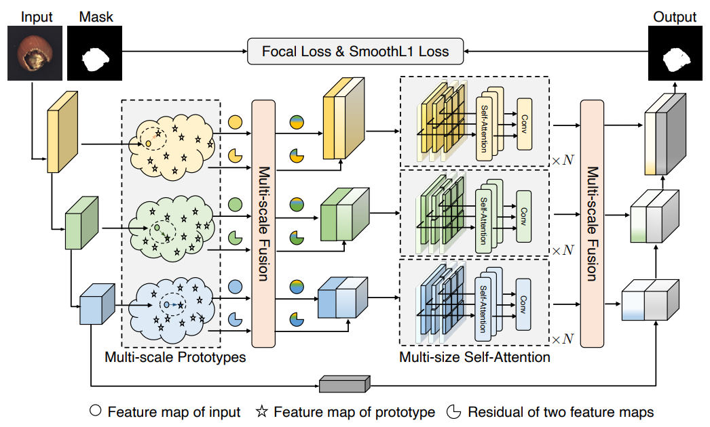

# PRNet
Unofficial Re-implementation for [Prototypical Residual Networks for Anomaly Detection and Localization](https://openaccess.thecvf.com/content/CVPR2023/papers/Zhang_Prototypical_Residual_Networks_for_Anomaly_Detection_and_Localization_CVPR_2023_paper.pdf)

# Description

Phát hiện và xác định bất thường được sử dụng rộng rãi trong sản xuất công nghiệp vì tính hiệu quả và hiệu suất của nó. Các sự bất thường thường hiếm và khó thu thập, và các mô hình giám sát dễ dàng bị quá khớp với những sự bất thường đã thấy với một số lượng nhỏ các mẫu bất thường, dẫn đến hiệu suất không đạt yêu cầu. Ngược lại, các sự bất thường thường tinh tế, khó phân biệt và có diện mạo đa dạng, làm cho việc phát hiện bất thường khó khăn và càng khó khăn hơn khi cần xác định vị trí khu vực bất thường.

Để giải quyết những vấn đề này, chúng tôi đề xuất một khung công việc được gọi là Mạng Lưu tích Chủ Đạo (Prototypical Residual Network - PRN), mà học các lưu tích đặc trưng của các quy mô và kích thước khác nhau giữa các mẫu bất thường và bình thường để tái tạo chính xác các bản đồ phân đoạn của các khu vực bất thường. PRN chủ yếu bao gồm hai phần: các nguyên mẫu đa quy mô mô tả rõ ràng các đặc trưng lưu tích của sự bất thường so với các mẫu bình thường; một cơ chế tự chú ý đa kích thước cho phép học đặc trưng bất thường có kích thước thay đổi. Ngoài ra, chúng tôi trình bày một loạt chiến lược tạo ra sự bất thường xem xét cả sự biến đổi về diện mạo đã thấy và chưa thấy để mở rộng và đa dạng hóa các sự bất thường. Thực nghiệm đầy đủ trên bộ thử thách và được sử dụng rộng rãi MVTec AD cho thấy PRN vượt qua các phương pháp không giám sát và giám sát tiên tiến hiện tại. Chúng tôi tiếp tục báo cáo kết quả SOTA trên ba tập dữ liệu bổ sung khác để chứng minh tính hiệu quả và khả năng tổng quát của PRN.

# Environments

```
einops
kornia
torchmetrics==0.10.3
timm
```


# Process

## 1. Anomaly Simulation Strategy 

- [mvtecdataset](https://github.com/pntrungbk15/TNVision/blob/main/task/anomaly/semisupervised/data/dataset.py)
- Describable Textures Dataset(DTD) [ [download](https://www.google.com/search?q=dtd+texture+dataset&rlz=1C5CHFA_enKR999KR999&oq=dtd+texture+dataset&aqs=chrome..69i57j69i60.2253j0j7&sourceid=chrome&ie=UTF-8) ]

<p align='center'>
    
</p>

## 2. Model Process 

- [model](https://github.com/pntrungbk15/TNVision/blob/main/task/anomaly/semisupervised/models/prnet/model/prnet.py)

<p align='center'>
    
</p>

# Run

```bash
python main.py --task_type anomaly --model_type semisupervised --model_name prnet --yaml_config configs/anomaly/semisupervised/prnet/bottle.yaml
```

## Demo

### zipper
<p align="left">
  
</p>

### wood
<p align="left">
  
</p>

### transistor
<p align="left">
  
</p>

### toothbrush
<p align="left">
  
</p>

### tile
<p align="left">
  
</p>

### screw
<p align="left">
  
</p>

### pill
<p align="left">
  
</p>

### metal_nut
<p align="left">
  
</p>

### leather
<p align="left">
  
</p>

### hazelnut
<p align="left">
  
</p>

### grid
<p align="left">
  
</p>

### carpet
<p align="left">
  
</p>

### capsule
<p align="left">
  
</p>

### cable
<p align="left">
  
</p>

### bottle
<p align="left">
  
</p>

# Results

### Image-Level AUC

|                          |  Avg  | Carpet | Grid  | Leather | Tile  | Wood  | Bottle | Cable | Capsule | Hazelnut | Metal Nut | Pill  | Screw | Toothbrush | Transistor | Zipper |
| ------------------------ | :---: | :----: | :---: | :-----: | :---: | :---: | :----: | :---: | :-----: | :------: | :-------: | :---: | :---: | :--------: | :--------: | :----: |
|  | 0.000 | 0.000  | 0.000 |  0.000  | 0.000 | 0.000 | 0.000  | 0.000 |  0.000  |  0.000   |   0.000   | 0.000 | 0.000 |   0.000    |   0.000    | 0.000  |

### Pixel-Level AUC

|                          |  Avg  | Carpet | Grid  | Leather | Tile  | Wood  | Bottle | Cable | Capsule | Hazelnut | Metal Nut | Pill  | Screw | Toothbrush | Transistor | Zipper |
| ------------------------ | :---: | :----: | :---: | :-----: | :---: | :---: | :----: | :---: | :-----: | :------: | :-------: | :---: | :---: | :--------: | :--------: | :----: |
|  | 0.000 | 0.000  | 0.000 |  0.000  | 0.000 | 0.000 | 0.000  | 0.000 |  0.000  |  0.000   |   0.000   | 0.000 | 0.000 |   0.000    |   0.000    | 0.000  |

### Pixel F1 Score

|                          |  Avg  | Carpet | Grid  | Leather | Tile  | Wood  | Bottle | Cable | Capsule | Hazelnut | Metal Nut | Pill  | Screw | Toothbrush | Transistor | Zipper |
| ------------------------ | :---: | :----: | :---: | :-----: | :---: | :---: | :----: | :---: | :-----: | :------: | :-------: | :---: | :---: | :--------: | :--------: | :----: |
|  | 0.000 | 0.000  | 0.000 |  0.000  | 0.000 | 0.000 | 0.000  | 0.000 |  0.000  |  0.000   |   0.000   | 0.000 | 0.000 |   0.000    |   0.000    | 0.000  |