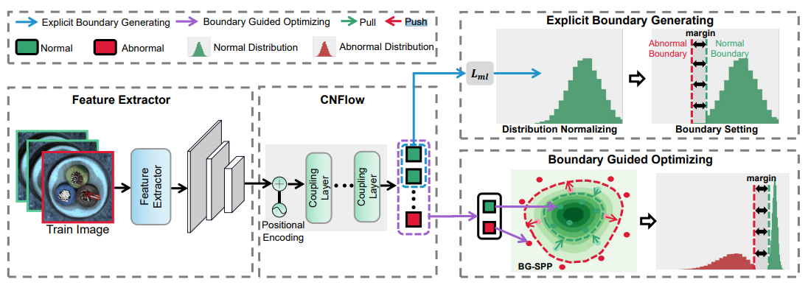

# BGAD
Unofficial Re-implementation for [Explicit Boundary Guided Semi-Push-Pull Contrastive Learning for Supervised Anomaly Detection](https://arxiv.org/pdf/2207.01463.pdf)

# Description

Hầu hết các mô hình phát hiện ngoại lệ (AD) được học bằng cách sử dụng chỉ các mẫu bình thường trong một cách không giám sát, điều này có thể dẫn đến ranh giới quyết định mơ hồ và khả năng phân biệt không đủ. Trong thực tế, một số mẫu ngoại lệ thường có sẵn trong các ứng dụng thế giới thực, kiến thức quý báu về các ngoại lệ đã biết cũng nên được khai thác một cách hiệu quả. Tuy nhiên, việc sử dụng một số ngoại lệ đã biết trong quá trình đào tạo có thể gây ra vấn đề khác là mô hình có thể bị thiên vị bởi các ngoại lệ đã biết đó và không thể tổng quát hóa được cho các ngoại lệ chưa biết. Trong bài báo này, chúng tôi giải quyết vấn đề phát hiện ngoại lệ giám sát, tức là chúng tôi học mô hình AD bằng cách sử dụng một số ngoại lệ có sẵn với mục tiêu phát hiện cả các ngoại lệ đã biết và chưa biết. Chúng tôi đề xuất một cơ chế học tương phản nửa bám giám sát mới mẻ, được hướng dẫn bởi ranh giới rõ ràng, có thể cải thiện tính phân biệt của mô hình trong khi giảm thiểu vấn đề thiên vị. Phương pháp của chúng tôi dựa trên hai thiết kế cốt lõi: Trước hết, chúng tôi tìm ra một ranh giới phân tách rõ ràng và gọn gàng để hướng dẫn việc học đặc trưng tiếp theo. Vì ranh giới chỉ phụ thuộc vào phân phối đặc trưng bình thường, vấn đề thiên vị do một số ngoại lệ đã biết có thể được giảm bớt. Thứ hai, chúng tôi phát triển một hàm mất mát nửa bám giám sát được hướng dẫn bởi ranh giới để chỉ kéo các đặc trưng bình thường lại gần nhau trong khi đẩy các đặc trưng bất thường ra xa ranh giới phân tách ngoài một khu vực ranh giới cố định. Bằng cách này, mô hình của chúng tôi có thể hình thành một ranh giới quyết định rõ ràng và phân biệt hơn để phân biệt các ngoại lệ đã biết và cũng như các ngoại lệ chưa biết khỏi các mẫu bình thường một cách hiệu quả hơn.

# Environments

```
einops
kornia
torchmetrics==0.10.3
timm
```


# Process

## 1. Dataset

- [mvtecdataset](https://github.com/pntrungbk15/TNVision/blob/main/task/anomaly/supervised/data/dataset.py)


## 2. Model Process 

- [model](https://github.com/pntrungbk15/TNVision/blob/main/task/anomaly/supervised/models/bgad/model/bgad.py)

<p align='center'>
    
</p>

# Run

```bash
python main.py --task_type anomaly --model_type supervised --model_name bgad --yaml_config configs/anomaly/supervised/bgad/bottle.yaml
```

## Demo

### zipper
<p align="left">
  
</p>

### wood
<p align="left">
  
</p>

### transistor
<p align="left">
  
</p>

### toothbrush
<p align="left">
  
</p>

### tile
<p align="left">
  
</p>

### screw
<p align="left">
  
</p>

### pill
<p align="left">
  
</p>

### metal_nut
<p align="left">
  
</p>

### leather
<p align="left">
  
</p>

### hazelnut
<p align="left">
  
</p>

### grid
<p align="left">
  
</p>

### carpet
<p align="left">
  
</p>

### capsule
<p align="left">
  
</p>

### cable
<p align="left">
  
</p>

### bottle
<p align="left">
  
</p>

# Results

### Image-Level AUC

|                          |  Avg  | Carpet | Grid  | Leather | Tile  | Wood  | Bottle | Cable | Capsule | Hazelnut | Metal Nut | Pill  | Screw | Toothbrush | Transistor | Zipper |
| ------------------------ | :---: | :----: | :---: | :-----: | :---: | :---: | :----: | :---: | :-----: | :------: | :-------: | :---: | :---: | :--------: | :--------: | :----: |
|  | 0.000 | 0.000  | 0.000 |  0.000  | 0.000 | 0.000 | 0.000  | 0.000 |  0.000  |  0.000   |   0.000   | 0.000 | 0.000 |   0.000    |   0.000    | 0.000  |

### Pixel-Level AUC

|                          |  Avg  | Carpet | Grid  | Leather | Tile  | Wood  | Bottle | Cable | Capsule | Hazelnut | Metal Nut | Pill  | Screw | Toothbrush | Transistor | Zipper |
| ------------------------ | :---: | :----: | :---: | :-----: | :---: | :---: | :----: | :---: | :-----: | :------: | :-------: | :---: | :---: | :--------: | :--------: | :----: |
|  | 0.000 | 0.000  | 0.000 |  0.000  | 0.000 | 0.000 | 0.000  | 0.000 |  0.000  |  0.000   |   0.000   | 0.000 | 0.000 |   0.000    |   0.000    | 0.000  |

### Pixel F1 Score

|                          |  Avg  | Carpet | Grid  | Leather | Tile  | Wood  | Bottle | Cable | Capsule | Hazelnut | Metal Nut | Pill  | Screw | Toothbrush | Transistor | Zipper |
| ------------------------ | :---: | :----: | :---: | :-----: | :---: | :---: | :----: | :---: | :-----: | :------: | :-------: | :---: | :---: | :--------: | :--------: | :----: |
|  | 0.000 | 0.000  | 0.000 |  0.000  | 0.000 | 0.000 | 0.000  | 0.000 |  0.000  |  0.000   |   0.000   | 0.000 | 0.000 |   0.000    |   0.000    | 0.000  |