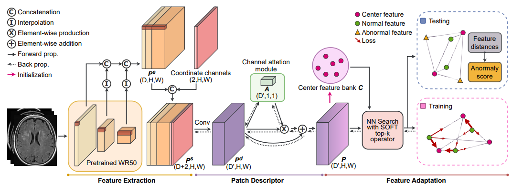

# ADFA
Unofficial Re-implementation for [ADFA: Attention-augmented Differentiable top-k Feature Adaptation for Unsupervised Medical Anomaly Detection](https://arxiv.org/pdf/2308.15280v1.pdf)

# Description

Sự hiếm hoi của dữ liệu được chú thích, đặc biệt là đối với các bệnh hiếm,
hạn chế sự biến đổi của dữ liệu đào tạo và phạm vi của các bất thường có thể phát hiện, đặt ra một thách thức đáng kể đối với việc phát hiện bất thường theo phương pháp học có giám sát trong hình ảnh y học. Để giải quyết vấn đề này, chúng tôi đề xuất một phương pháp không giám sát mới cho việc phát hiện bất thường trong hình ảnh y học: Attention-Augmented Differentiable top-k Feature Adaptation (ADFA). Phương pháp này sử dụng mạng Wide-ResNet50-2 (WR50) được đào tạo trước trên ImageNet để trích xuất các biểu diễn đặc trưng ban đầu. Để giảm chiều của kênh trong khi bảo tồn thông tin kênh liên quan, chúng tôi sử dụng một mô tả viên gắn trọng tâm được bổ sung trên các đặc trưng trích xuất. Sau đó, chúng tôi áp dụng sự điều chỉnh đặc trưng top-k có khả năng khác biệt để huấn luyện mô tả viên gắn trọng tâm, ánh xạ các biểu diễn đặc trưng trích xuất vào không gian vector mới, cho phép phát hiện hiệu quả các bất thường. Các thử nghiệm cho thấy rằng ADFA vượt qua các phương pháp tốt nhất (SOTA) trên nhiều tập dữ liệu hình ảnh y học khó khăn, xác nhận tính hiệu quả của nó trong việc phát hiện bất thường y học.

# Environments

```
einops
kornia
torchmetrics==0.10.3
timm
```


# Process

## 1. Dataset

- [mvtecdataset](https://github.com/pntrungbk15/TNVision/blob/main/task/anomaly/unsupervised/data/dataset.py)


## 2. Model Process 

- [model](https://github.com/pntrungbk15/TNVision/blob/main/task/anomaly/unsupervised/models/adfa/model/adfa.py)

<p align='center'>
    
</p>

# Run

```bash
python main.py --task_type anomaly --model_type unsupervised --model_name adfa --yaml_config configs/anomaly/unsupervised/adfa/bottle.yaml
```

## Demo

### zipper
<p align="left">
  
</p>

### wood
<p align="left">
  
</p>

### transistor
<p align="left">
  
</p>

### toothbrush
<p align="left">
  
</p>

### tile
<p align="left">
  
</p>

### screw
<p align="left">
  
</p>

### pill
<p align="left">
  
</p>

### metal_nut
<p align="left">
  
</p>

### leather
<p align="left">
  
</p>

### hazelnut
<p align="left">
  
</p>

### grid
<p align="left">
  
</p>

### carpet
<p align="left">
  
</p>

### capsule
<p align="left">
  
</p>

### cable
<p align="left">
  
</p>

### bottle
<p align="left">
  
</p>

# Results

### Image-Level AUC

|                          |  Avg  | Carpet | Grid  | Leather | Tile  | Wood  | Bottle | Cable | Capsule | Hazelnut | Metal Nut | Pill  | Screw | Toothbrush | Transistor | Zipper |
| ------------------------ | :---: | :----: | :---: | :-----: | :---: | :---: | :----: | :---: | :-----: | :------: | :-------: | :---: | :---: | :--------: | :--------: | :----: |
|  | 0.000 | 0.000  | 0.000 |  0.000  | 0.000 | 0.000 | 0.000  | 0.000 |  0.000  |  0.000   |   0.000   | 0.000 | 0.000 |   0.000    |   0.000    | 0.000  |

### Pixel-Level AUC

|                          |  Avg  | Carpet | Grid  | Leather | Tile  | Wood  | Bottle | Cable | Capsule | Hazelnut | Metal Nut | Pill  | Screw | Toothbrush | Transistor | Zipper |
| ------------------------ | :---: | :----: | :---: | :-----: | :---: | :---: | :----: | :---: | :-----: | :------: | :-------: | :---: | :---: | :--------: | :--------: | :----: |
|  | 0.000 | 0.000  | 0.000 |  0.000  | 0.000 | 0.000 | 0.000  | 0.000 |  0.000  |  0.000   |   0.000   | 0.000 | 0.000 |   0.000    |   0.000    | 0.000  |

### Pixel F1 Score

|                          |  Avg  | Carpet | Grid  | Leather | Tile  | Wood  | Bottle | Cable | Capsule | Hazelnut | Metal Nut | Pill  | Screw | Toothbrush | Transistor | Zipper |
| ------------------------ | :---: | :----: | :---: | :-----: | :---: | :---: | :----: | :---: | :-----: | :------: | :-------: | :---: | :---: | :--------: | :--------: | :----: |
|  | 0.000 | 0.000  | 0.000 |  0.000  | 0.000 | 0.000 | 0.000  | 0.000 |  0.000  |  0.000   |   0.000   | 0.000 | 0.000 |   0.000    |   0.000    | 0.000  |