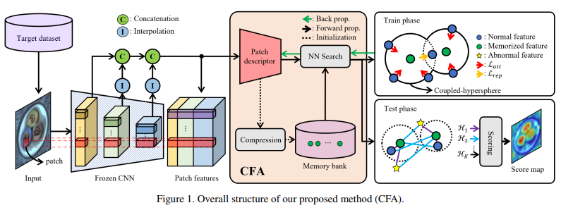

# CFA
Unofficial Re-implementation for [CFA: Coupled-hypersphere-based Feature Adaptation for Target-Oriented Anomaly Localization](https://arxiv.org/pdf/2206.04325.pdf)

# Description

Trong một thời gian dài, việc xác định ngoại lệ đã được sử dụng rộng rãi trong các ngành công nghiệp. Các nghiên cứu trước đây tập trung vào việc xấp xỉ phân phối các đặc trưng bình thường mà không điều chỉnh cho tập dữ liệu mục tiêu. Tuy nhiên, vì việc xác định ngoại lệ phải phân biệt chính xác các đặc trưng bình thường và bất thường, việc không điều chỉnh có thể khiến cho tính bình thường của các đặc trưng bất thường được đánh giá cao hơn. Do đó, chúng tôi đề xuất phương pháp Điều Chỉnh Đặc Trưng Dựa Trên Siêu Cầu Kết Nối (CFA) để đạt được xác định ngoại lệ tinh vi bằng cách sử dụng các đặc trưng đã điều chỉnh cho tập dữ liệu mục tiêu. CFA bao gồm (1) một mô tả miếng học có thể học được, học và nhúng các đặc trưng hướng tới mục tiêu và (2) bộ nhớ có khả năng mở rộng độc lập với kích thước của tập dữ liệu mục tiêu. Và, CFA sử dụng học chuyển giao để tăng mật độ đặc trưng bình thường để các đặc trưng bất thường có thể được phân biệt rõ bằng cách áp dụng miêu tả miếng và bộ nhớ vào một mạng nơ-ron tích chập được huấn luyện trước. Phương pháp được đề xuất vượt trội hơn so với các phương pháp trước đó về mặt số lượng và chất lượng. Ví dụ, nó cung cấp một điểm AUROC của 99,5% trong phát hiện ngoại lệ và 98,5% trong xác định ngoại lệ của bộ thử nghiệm MVTec AD. Bên cạnh đó, bài báo này chỉ ra những ảnh hưởng tiêu cực của các đặc trưng thiên vị của mạng tích chập được huấn luyện trước và nhấn mạnh sự quan trọng của điều chỉnh cho tập dữ liệu mục tiêu.

# Environments

```
einops
kornia
torchmetrics==0.10.3
timm
```


# Process

## 1. Dataset

- [mvtecdataset](https://github.com/pntrungbk15/TNVision/blob/main/task/anomaly/unsupervised/data/dataset.py)


## 2. Model Process 

- [model](https://github.com/pntrungbk15/TNVision/blob/main/task/anomaly/unsupervised/models/cfa/model/cfa.py)

<p align='center'>
    
</p>

# Run

```bash
python main.py --task_type anomaly --model_type unsupervised --model_name cfa --yaml_config configs/anomaly/unsupervised/cfa/bottle.yaml
```

## Demo

### zipper
<p align="left">
  
</p>

### wood
<p align="left">
  
</p>

### transistor
<p align="left">
  
</p>

### toothbrush
<p align="left">
  
</p>

### tile
<p align="left">
  
</p>

### screw
<p align="left">
  
</p>

### pill
<p align="left">
  
</p>

### metal_nut
<p align="left">
  
</p>

### leather
<p align="left">
  
</p>

### hazelnut
<p align="left">
  
</p>

### grid
<p align="left">
  
</p>

### carpet
<p align="left">
  
</p>

### capsule
<p align="left">
  
</p>

### cable
<p align="left">
  
</p>

### bottle
<p align="left">
  
</p>

# Results

### Image-Level AUC

|                          |  Avg  | Carpet | Grid  | Leather | Tile  | Wood  | Bottle | Cable | Capsule | Hazelnut | Metal Nut | Pill  | Screw | Toothbrush | Transistor | Zipper |
| ------------------------ | :---: | :----: | :---: | :-----: | :---: | :---: | :----: | :---: | :-----: | :------: | :-------: | :---: | :---: | :--------: | :--------: | :----: |
|  | 0.000 | 0.000  | 0.000 |  0.000  | 0.000 | 0.000 | 0.000  | 0.000 |  0.000  |  0.000   |   0.000   | 0.000 | 0.000 |   0.000    |   0.000    | 0.000  |

### Pixel-Level AUC

|                          |  Avg  | Carpet | Grid  | Leather | Tile  | Wood  | Bottle | Cable | Capsule | Hazelnut | Metal Nut | Pill  | Screw | Toothbrush | Transistor | Zipper |
| ------------------------ | :---: | :----: | :---: | :-----: | :---: | :---: | :----: | :---: | :-----: | :------: | :-------: | :---: | :---: | :--------: | :--------: | :----: |
|  | 0.000 | 0.000  | 0.000 |  0.000  | 0.000 | 0.000 | 0.000  | 0.000 |  0.000  |  0.000   |   0.000   | 0.000 | 0.000 |   0.000    |   0.000    | 0.000  |

### Pixel F1 Score

|                          |  Avg  | Carpet | Grid  | Leather | Tile  | Wood  | Bottle | Cable | Capsule | Hazelnut | Metal Nut | Pill  | Screw | Toothbrush | Transistor | Zipper |
| ------------------------ | :---: | :----: | :---: | :-----: | :---: | :---: | :----: | :---: | :-----: | :------: | :-------: | :---: | :---: | :--------: | :--------: | :----: |
|  | 0.000 | 0.000  | 0.000 |  0.000  | 0.000 | 0.000 | 0.000  | 0.000 |  0.000  |  0.000   |   0.000   | 0.000 | 0.000 |   0.000    |   0.000    | 0.000  |