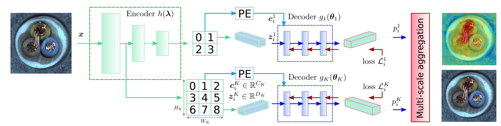

# CFLOw
Unofficial Re-implementation for [CFLOW-AD: Real-Time Unsupervised Anomaly Detection with Localization via Conditional Normalizing Flows](https://arxiv.org/pdf/2107.12571.pdf)

# Description

Phát hiện bất thường không giám sát kèm định vị có nhiều ứng dụng thực tế khi việc gán nhãn là không khả thi và, hơn nữa, khi các ví dụ về bất thường hoàn toàn thiếu trong dữ liệu huấn luyện. Trong khi các mô hình được đề xuất gần đây cho loại dữ liệu này đạt được các chỉ số độ chính xác cao, thì độ phức tạp của chúng là một yếu tố hạn chế đối với xử lý thời gian thực. Trong bài viết này, chúng tôi đề xuất một mô hình thời gian thực và tính toán mối quan hệ của nó với các phương pháp trước đó. Mô hình CFLOW-AD của chúng tôi dựa trên một khung làm việc dựa trên luồng chuẩn hóa có điều kiện được áp dụng cho việc phát hiện bất thường kèm định vị. Cụ thể, CFLOW-AD bao gồm một bộ mã hóa được đào tạo một cách phân biệt, tiếp theo là các bộ giải mã sinh ra đa tầng có thể ước tính một cách rõ ràng khả năng của các đặc trưng đã được mã hóa. Phương pháp của chúng tôi dẫn đến một mô hình có hiệu suất tính toán và sử dụng bộ nhớ hiệu quả: CFLOW-AD nhanh hơn và nhỏ hơn 10 lần so với trạng thái hiện đại trước đó với cùng cấu hình đầu vào.

# Environments

```
einops
kornia
torchmetrics==0.10.3
timm
```


# Process

## 1. Dataset

- [mvtecdataset](https://github.com/pntrungbk15/TNVision/blob/main/task/anomaly/unsupervised/data/dataset.py)


## 2. Model Process 

- [model](https://github.com/pntrungbk15/TNVision/blob/main/task/anomaly/unsupervised/models/cflow/model/cflow.py)

<p align='center'>
    
</p>

# Run

```bash
python main.py --task_type anomaly --model_type unsupervised --model_name cflow --yaml_config configs/anomaly/unsupervised/cflow/bottle.yaml
```

## Demo

### zipper
<p align="left">
  
</p>

### wood
<p align="left">
  
</p>

### transistor
<p align="left">
  
</p>

### toothbrush
<p align="left">
  
</p>

### tile
<p align="left">
  
</p>

### screw
<p align="left">
  
</p>

### pill
<p align="left">
  
</p>

### metal_nut
<p align="left">
  
</p>

### leather
<p align="left">
  
</p>

### hazelnut
<p align="left">
  
</p>

### grid
<p align="left">
  
</p>

### carpet
<p align="left">
  
</p>

### capsule
<p align="left">
  
</p>

### cable
<p align="left">
  
</p>

### bottle
<p align="left">
  
</p>

# Results

### Image-Level AUC

|                          |  Avg  | Carpet | Grid  | Leather | Tile  | Wood  | Bottle | Cable | Capsule | Hazelnut | Metal Nut | Pill  | Screw | Toothbrush | Transistor | Zipper |
| ------------------------ | :---: | :----: | :---: | :-----: | :---: | :---: | :----: | :---: | :-----: | :------: | :-------: | :---: | :---: | :--------: | :--------: | :----: |
|  | 0.000 | 0.000  | 0.000 |  0.000  | 0.000 | 0.000 | 0.000  | 0.000 |  0.000  |  0.000   |   0.000   | 0.000 | 0.000 |   0.000    |   0.000    | 0.000  |

### Pixel-Level AUC

|                          |  Avg  | Carpet | Grid  | Leather | Tile  | Wood  | Bottle | Cable | Capsule | Hazelnut | Metal Nut | Pill  | Screw | Toothbrush | Transistor | Zipper |
| ------------------------ | :---: | :----: | :---: | :-----: | :---: | :---: | :----: | :---: | :-----: | :------: | :-------: | :---: | :---: | :--------: | :--------: | :----: |
|  | 0.000 | 0.000  | 0.000 |  0.000  | 0.000 | 0.000 | 0.000  | 0.000 |  0.000  |  0.000   |   0.000   | 0.000 | 0.000 |   0.000    |   0.000    | 0.000  |

### Pixel F1 Score

|                          |  Avg  | Carpet | Grid  | Leather | Tile  | Wood  | Bottle | Cable | Capsule | Hazelnut | Metal Nut | Pill  | Screw | Toothbrush | Transistor | Zipper |
| ------------------------ | :---: | :----: | :---: | :-----: | :---: | :---: | :----: | :---: | :-----: | :------: | :-------: | :---: | :---: | :--------: | :--------: | :----: |
|  | 0.000 | 0.000  | 0.000 |  0.000  | 0.000 | 0.000 | 0.000  | 0.000 |  0.000  |  0.000   |   0.000   | 0.000 | 0.000 |   0.000    |   0.000    | 0.000  |