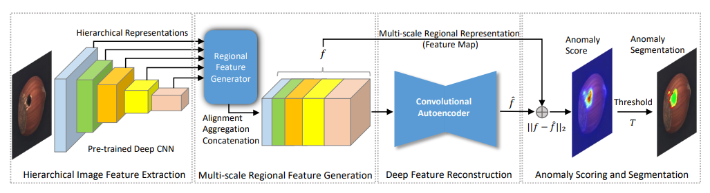

# DFR
Unofficial Re-implementation for [DFR: Deep Feature Reconstruction for Unsupervised Anomaly Segmentation](https://arxiv.org/pdf/2012.07122.pdf)

# Description

Phát hiện tự động các vùng bất thường trong hình ảnh của đối tượng hoặc cấu trúc mà không có thông tin trước về các bất thường là một thách thức, đặc biệt khi các bất thường xuất hiện trong các vùng rất nhỏ của hình ảnh, gây ra những biến thể hình ảnh khó phát hiện, như các khuyết điểm trên các sản phẩm sản xuất. Bài báo này đề xuất một phương pháp phân đoạn bất thường không giám sát hiệu quả có thể phát hiện và phân đoạn các bất thường trong các vùng nhỏ và hạn chế của hình ảnh. Cụ thể, chúng tôi phát triển một bộ tạo đặc trưng vùng đa tỷ lệ có thể tạo ra nhiều biểu diễn phù hợp với ngữ cảnh không gian từ các mạng tích chập sâu được huấn luyện trước cho mỗi vùng con của hình ảnh. Các biểu diễn vùng không chỉ mô tả đặc điểm cục bộ của các vùng tương ứng mà còn mã hóa thông tin ngữ cảnh không gian đa dạng của chúng, làm cho chúng phân biệt và rất hữu ích cho việc phát hiện bất thường. Bằng cách sử dụng các đặc trưng vùng mô tả này, chúng tôi thiết kế một bộ mã tự động tích chập sâu hiệu quả nhưng sâu và phát hiện các vùng bất thường trong hình ảnh thông qua việc tái tạo đặc trưng nhanh chóng. Phương pháp của chúng tôi đơn giản nhưng hiệu quả và hiệu quả. Nó cải thiện hiệu suất hàng đầu trên một số tập dữ liệu thử nghiệm và cho thấy tiềm năng lớn cho các ứng dụng thực tế.

# Environments

```
einops
kornia
torchmetrics==0.10.3
timm
```


# Process

## 1. Dataset

- [mvtecdataset](https://github.com/pntrungbk15/TNVision/blob/main/task/anomaly/unsupervised/data/dataset.py)


## 2. Model Process 

- [model](https://github.com/pntrungbk15/TNVision/blob/main/task/anomaly/unsupervised/models/dfr/model/dfr.py)

<p align='center'>
    
</p>

# Run

```bash
python main.py --task_type anomaly --model_type unsupervised --model_name dfr --yaml_config configs/anomaly/unsupervised/dfr/bottle.yaml
```

## Demo

### zipper
<p align="left">
  
</p>

### wood
<p align="left">
  
</p>

### transistor
<p align="left">
  
</p>

### toothbrush
<p align="left">
  
</p>

### tile
<p align="left">
  
</p>

### screw
<p align="left">
  
</p>

### pill
<p align="left">
  
</p>

### metal_nut
<p align="left">
  
</p>

### leather
<p align="left">
  
</p>

### hazelnut
<p align="left">
  
</p>

### grid
<p align="left">
  
</p>

### carpet
<p align="left">
  
</p>

### capsule
<p align="left">
  
</p>

### cable
<p align="left">
  
</p>

### bottle
<p align="left">
  
</p>

# Results

### Image-Level AUC

|                          |  Avg  | Carpet | Grid  | Leather | Tile  | Wood  | Bottle | Cable | Capsule | Hazelnut | Metal Nut | Pill  | Screw | Toothbrush | Transistor | Zipper |
| ------------------------ | :---: | :----: | :---: | :-----: | :---: | :---: | :----: | :---: | :-----: | :------: | :-------: | :---: | :---: | :--------: | :--------: | :----: |
|  | 0.000 | 0.000  | 0.000 |  0.000  | 0.000 | 0.000 | 0.000  | 0.000 |  0.000  |  0.000   |   0.000   | 0.000 | 0.000 |   0.000    |   0.000    | 0.000  |

### Pixel-Level AUC

|                          |  Avg  | Carpet | Grid  | Leather | Tile  | Wood  | Bottle | Cable | Capsule | Hazelnut | Metal Nut | Pill  | Screw | Toothbrush | Transistor | Zipper |
| ------------------------ | :---: | :----: | :---: | :-----: | :---: | :---: | :----: | :---: | :-----: | :------: | :-------: | :---: | :---: | :--------: | :--------: | :----: |
|  | 0.000 | 0.000  | 0.000 |  0.000  | 0.000 | 0.000 | 0.000  | 0.000 |  0.000  |  0.000   |   0.000   | 0.000 | 0.000 |   0.000    |   0.000    | 0.000  |

### Pixel F1 Score

|                          |  Avg  | Carpet | Grid  | Leather | Tile  | Wood  | Bottle | Cable | Capsule | Hazelnut | Metal Nut | Pill  | Screw | Toothbrush | Transistor | Zipper |
| ------------------------ | :---: | :----: | :---: | :-----: | :---: | :---: | :----: | :---: | :-----: | :------: | :-------: | :---: | :---: | :--------: | :--------: | :----: |
|  | 0.000 | 0.000  | 0.000 |  0.000  | 0.000 | 0.000 | 0.000  | 0.000 |  0.000  |  0.000   |   0.000   | 0.000 | 0.000 |   0.000    |   0.000    | 0.000  |