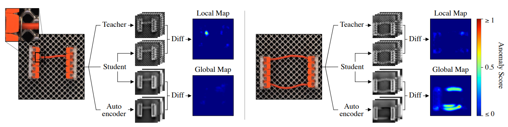

# EfficientAD
Unofficial Re-implementation for [EfficientAD: Accurate Visual Anomaly Detection at Millisecond-Level Latencies](https://arxiv.org/pdf/2303.14535.pdf)

# Description

Phát hiện các sự bất thường trong hình ảnh là một nhiệm vụ quan trọng, đặc biệt trong các ứng dụng thị giác máy tính thời gian thực. Trong công việc này, chúng tôi tập trung vào hiệu suất tính toán và đề xuất một trích xuất đặc trưng nhẹ, xử lý một hình ảnh trong thời gian ít hơn một mili giây trên một GPU hiện đại. Sau đó, chúng tôi sử dụng phương pháp học sinh-giáo viên để phát hiện các đặc trưng bất thường. Chúng tôi huấn luyện một mạng học sinh để dự đoán các đặc trưng đã trích xuất từ các hình ảnh đào tạo bình thường, tức là không có bất kỳ sự bất thường nào. Việc phát hiện các sự bất thường trong quá trình kiểm tra được thực hiện thông qua việc mạng học sinh không thể dự đoán các đặc trưng này. Chúng tôi đề xuất một hàm mất mát huấn luyện ngăn cản mạng học sinh sao chép trích xuất đặc trưng của mạng học viên vượt quá phạm vi hình ảnh bình thường. Điều này giúp giảm đáng kể chi phí tính toán của mô hình học sinh-giáo viên, đồng thời cải thiện việc phát hiện các đặc trưng bất thường. Chúng tôi cũng đề cập đến việc phát hiện các sự bất thường logic đầy thách thức, bao gồm các kết hợp không hợp lệ của các đặc trưng địa phương bình thường, ví dụ như sắp xếp sai thứ tự các đối tượng. Chúng tôi phát hiện các sự bất thường này bằng cách hiệu quả kết hợp một bộ giải mã tự động phân tích toàn cầu các hình ảnh. Chúng tôi đánh giá phương pháp của mình, gọi là EfficientAD, trên 32 bộ dữ liệu từ ba bộ sưu tập dữ liệu phát hiện sự bất thường công nghiệp. EfficientAD đặt ra các tiêu chuẩn mới cho cả việc phát hiện và xác định vị trí của các sự bất thường. Với thời gian đáp ứng hai mili giây và công suất xử lý sáu trăm hình ảnh mỗi giây, nó cho phép xử lý nhanh các sự bất thường. Cùng với tỷ lệ lỗi thấp, điều này tạo ra một giải pháp kinh tế cho các ứng dụng thực tế và là một cơ sở đáng kỳ vọng cho nghiên cứu tương lai.

# Environments

```
einops
kornia
torchmetrics==0.10.3
timm
```


# Process

## 1. Dataset

- [mvtecdataset](https://github.com/pntrungbk15/TNVision/blob/main/task/anomaly/unsupervised/data/dataset.py)


## 2. Model Process 

- [model](https://github.com/pntrungbk15/TNVision/blob/main/task/anomaly/unsupervised/models/efficientad/model/efficientad.py)

<p align='center'>
    
</p>

# Run

```bash
python main.py --task_type anomaly --model_type unsupervised --model_name efficientad --yaml_config configs/anomaly/unsupervised/efficientad/bottle.yaml
```

## Demo

### zipper
<p align="left">
  
</p>

### wood
<p align="left">
  
</p>

### transistor
<p align="left">
  
</p>

### toothbrush
<p align="left">
  
</p>

### tile
<p align="left">
  
</p>

### screw
<p align="left">
  
</p>

### pill
<p align="left">
  
</p>

### metal_nut
<p align="left">
  
</p>

### leather
<p align="left">
  
</p>

### hazelnut
<p align="left">
  
</p>

### grid
<p align="left">
  
</p>

### carpet
<p align="left">
  
</p>

### capsule
<p align="left">
  
</p>

### cable
<p align="left">
  
</p>

### bottle
<p align="left">
  
</p>

# Results

### Image-Level AUC

|                          |  Avg  | Carpet | Grid  | Leather | Tile  | Wood  | Bottle | Cable | Capsule | Hazelnut | Metal Nut | Pill  | Screw | Toothbrush | Transistor | Zipper |
| ------------------------ | :---: | :----: | :---: | :-----: | :---: | :---: | :----: | :---: | :-----: | :------: | :-------: | :---: | :---: | :--------: | :--------: | :----: |
|  | 0.000 | 0.000  | 0.000 |  0.000  | 0.000 | 0.000 | 0.000  | 0.000 |  0.000  |  0.000   |   0.000   | 0.000 | 0.000 |   0.000    |   0.000    | 0.000  |

### Pixel-Level AUC

|                          |  Avg  | Carpet | Grid  | Leather | Tile  | Wood  | Bottle | Cable | Capsule | Hazelnut | Metal Nut | Pill  | Screw | Toothbrush | Transistor | Zipper |
| ------------------------ | :---: | :----: | :---: | :-----: | :---: | :---: | :----: | :---: | :-----: | :------: | :-------: | :---: | :---: | :--------: | :--------: | :----: |
|  | 0.000 | 0.000  | 0.000 |  0.000  | 0.000 | 0.000 | 0.000  | 0.000 |  0.000  |  0.000   |   0.000   | 0.000 | 0.000 |   0.000    |   0.000    | 0.000  |

### Pixel F1 Score

|                          |  Avg  | Carpet | Grid  | Leather | Tile  | Wood  | Bottle | Cable | Capsule | Hazelnut | Metal Nut | Pill  | Screw | Toothbrush | Transistor | Zipper |
| ------------------------ | :---: | :----: | :---: | :-----: | :---: | :---: | :----: | :---: | :-----: | :------: | :-------: | :---: | :---: | :--------: | :--------: | :----: |
|  | 0.000 | 0.000  | 0.000 |  0.000  | 0.000 | 0.000 | 0.000  | 0.000 |  0.000  |  0.000   |   0.000   | 0.000 | 0.000 |   0.000    |   0.000    | 0.000  |