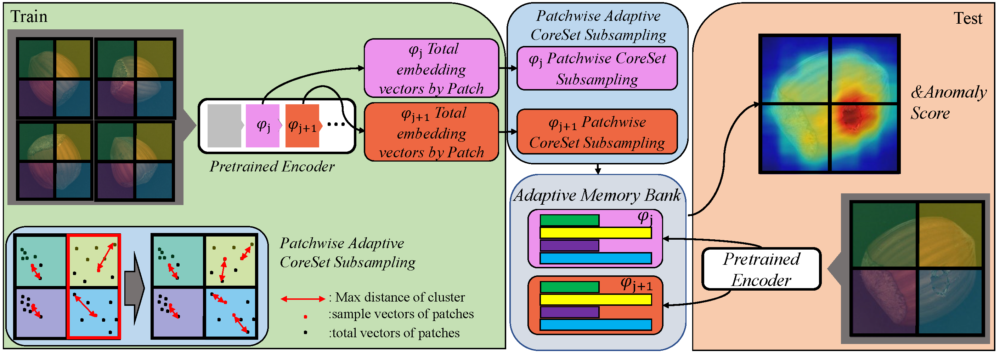

# FAPM
Unofficial Re-implementation for [FAPM: Fast Adaptive Patch Memory for Real-time Industrial Anomaly Detection](https://arxiv.org/pdf/2106.08265.pdf)

## Description

Các phương pháp dựa trên nhúng đặc trưng đã thể hiện hiệu suất xuất sắc trong việc phát hiện các sự cố công nghiệp bằng cách so sánh các đặc trưng của hình ảnh mục tiêu với hình ảnh bình thường. Tuy nhiên, một số phương pháp không đáp ứng được yêu cầu về tốc độ của việc suy luận thời gian thực, điều này rất quan trọng đối với các ứng dụng thực tế. Để giải quyết vấn đề này, chúng tôi đề xuất một phương pháp mới mang tên Fast Adaptive Patch Memory (FAPM) cho việc phát hiện sự cố công nghiệp thời gian thực. FAPM sử dụng các ngân hàng bộ nhớ theo từng miếng và từng lớp lưu trữ các đặc trưng nhúng của hình ảnh ở cấp độ miếng và cấp độ lớp, lần lượt loại bỏ các tính toán lặp lại không cần thiết. Chúng tôi cũng đề xuất việc lấy mẫu tập con cốt lõi thích ứng theo từng miếng để có sự phát hiện nhanh hơn và chính xác hơn. FAPM hoạt động tốt cả về độ chính xác và tốc độ so với các phương pháp tiên tiến khác.

# Environments

```
einops
kornia
torchmetrics==0.10.3
timm
```


# Process

## 1. Dataset

- [mvtecdataset](https://github.com/pntrungbk15/TNVision/blob/main/task/anomaly/unsupervised/data/dataset.py)


## 2. Model Process 

- [model](https://github.com/pntrungbk15/TNVisionV2/blob/main/task/anomaly/unsupervised/models/fapm/model/fapm.py)

<p align='center'>
    
</p>


# Run

```bash
python main.py --task_type anomaly --model_type unsupervised --model_name fapm --yaml_config configs/anomaly/unsupervised/fapm/bottle.yaml
```

## Demo

### zipper
<p align="left">
  
</p>

### wood
<p align="left">
  
</p>

### transistor
<p align="left">
  
</p>

### toothbrush
<p align="left">
  
</p>

### tile
<p align="left">
  
</p>

### screw
<p align="left">
  
</p>

### pill
<p align="left">
  
</p>

### metal_nut
<p align="left">
  
</p>

### leather
<p align="left">
  
</p>

### hazelnut
<p align="left">
  
</p>

### grid
<p align="left">
  
</p>

### carpet
<p align="left">
  
</p>

### capsule
<p align="left">
  
</p>

### cable
<p align="left">
  
</p>

### bottle
<p align="left">
  
</p>

# Results

### Image-Level AUC

|                          |  Avg  | Carpet | Grid  | Leather | Tile  | Wood  | Bottle | Cable | Capsule | Hazelnut | Metal Nut | Pill  | Screw | Toothbrush | Transistor | Zipper |
| ------------------------ | :---: | :----: | :---: | :-----: | :---: | :---: | :----: | :---: | :-----: | :------: | :-------: | :---: | :---: | :--------: | :--------: | :----: |
|  | 0.000 | 0.000  | 0.000 |  0.000  | 0.000 | 0.000 | 0.000  | 0.000 |  0.000  |  0.000   |   0.000   | 0.000 | 0.000 |   0.000    |   0.000    | 0.000  |

### Pixel-Level AUC

|                          |  Avg  | Carpet | Grid  | Leather | Tile  | Wood  | Bottle | Cable | Capsule | Hazelnut | Metal Nut | Pill  | Screw | Toothbrush | Transistor | Zipper |
| ------------------------ | :---: | :----: | :---: | :-----: | :---: | :---: | :----: | :---: | :-----: | :------: | :-------: | :---: | :---: | :--------: | :--------: | :----: |
|  | 0.000 | 0.000  | 0.000 |  0.000  | 0.000 | 0.000 | 0.000  | 0.000 |  0.000  |  0.000   |   0.000   | 0.000 | 0.000 |   0.000    |   0.000    | 0.000  |

### Pixel F1 Score

|                          |  Avg  | Carpet | Grid  | Leather | Tile  | Wood  | Bottle | Cable | Capsule | Hazelnut | Metal Nut | Pill  | Screw | Toothbrush | Transistor | Zipper |
| ------------------------ | :---: | :----: | :---: | :-----: | :---: | :---: | :----: | :---: | :-----: | :------: | :-------: | :---: | :---: | :--------: | :--------: | :----: |
|  | 0.000 | 0.000  | 0.000 |  0.000  | 0.000 | 0.000 | 0.000  | 0.000 |  0.000  |  0.000   |   0.000   | 0.000 | 0.000 |   0.000    |   0.000    | 0.000  |