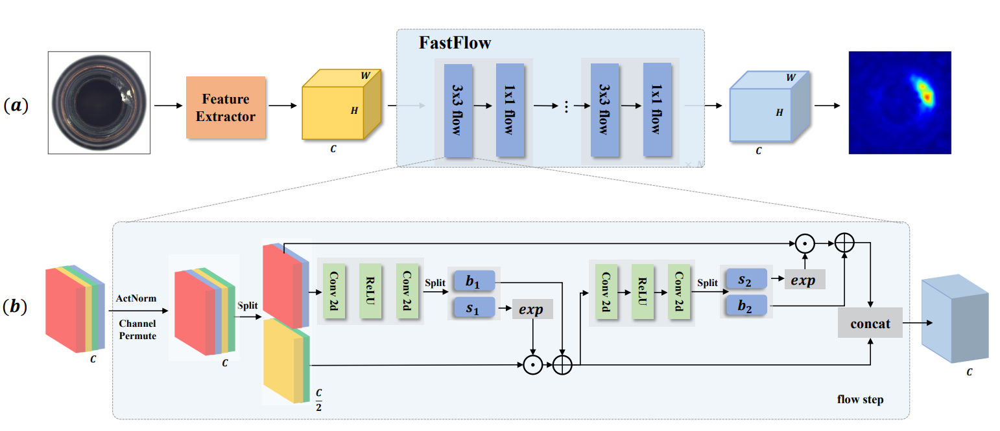

# FastFlow
Unofficial Re-implementation for [FastFlow: Unsupervised Anomaly Detection and Localization via 2D Normalizing Flows](https://arxiv.org/pdf/2111.07677.pdf)

## Description

Phát hiện và xác định ngoại lệ không giám sát là rất quan trọng trong các ứng dụng thực tế khi thu thập và đánh nhãn dữ liệu ngoại lệ đủ không khả thi. Hầu hết các phương pháp hiện tại dựa trên đặc trưng hình ảnh bình thường được trích xuất bằng mạng nơ-ron tích chập sâu và đặc trưng tương ứng được miêu tả thông qua các phương pháp ước lượng phân phối phi tham số. Điểm số ngoại lệ được tính bằng cách đo khoảng cách giữa đặc trưng của hình ảnh thử nghiệm và phân phối ước tính. Tuy nhiên, các phương pháp hiện tại không thể ánh xạ đặc trưng hình ảnh hiệu quả vào một phân phối cơ sở dễ xử lý và bỏ qua mối quan hệ giữa đặc trưng cục bộ và toàn cục, điều này quan trọng để xác định các ngoại lệ. Vì vậy, chúng tôi đề xuất FastFlow được thực hiện bằng phương pháp dòng thông thường 2D và sử dụng nó như bộ ước tính phân phối xác suất. FastFlow của chúng tôi có thể được sử dụng như một mô-đun plug-in với bất kỳ trích xuất đặc trưng sâu tùy ý nào như ResNet và vision transformer cho phát hiện và xác định ngoại lệ không giám sát. Trong giai đoạn đào tạo, FastFlow học cách biến đổi đặc trưng hình ảnh đầu vào thành một phân phối dễ xử lý và thu được khả năng xác định ngoại lệ trong giai đoạn suy luận. Kết quả thực nghiệm rộng trên tập dữ liệu MVTec AD cho thấy rằng FastFlow vượt qua các phương pháp tiên tiến trước đó về độ chính xác và hiệu quả suy luận với nhiều mạng cốt lõi khác nhau. Phương pháp của chúng tôi đạt được 99,4% AUC trong phát hiện ngoại lệ với hiệu suất suy luận cao.

# Environments

```
einops
kornia
torchmetrics==0.10.3
timm
```


# Process

## 1. Dataset

- [mvtecdataset](https://github.com/pntrungbk15/TNVision/blob/main/task/anomaly/unsupervised/data/dataset.py)


## 2. Model Process 

- [model](https://github.com/pntrungbk15/TNVision/blob/main/task/anomaly/unsupervised/models/fastflow/model/fastflow.py)

<p align='center'>
    
</p>


# Run

```bash
python main.py --task_type anomaly --model_type unsupervised --model_name fastflow --yaml_config configs/anomaly/unsupervised/fastflow/bottle.yaml
```

## Demo

### zipper
<p align="left">
  
</p>

### wood
<p align="left">
  
</p>

### transistor
<p align="left">
  
</p>

### toothbrush
<p align="left">
  
</p>

### tile
<p align="left">
  
</p>

### screw
<p align="left">
  
</p>

### pill
<p align="left">
  
</p>

### metal_nut
<p align="left">
  
</p>

### leather
<p align="left">
  
</p>

### hazelnut
<p align="left">
  
</p>

### grid
<p align="left">
  
</p>

### carpet
<p align="left">
  
</p>

### capsule
<p align="left">
  
</p>

### cable
<p align="left">
  
</p>

### bottle
<p align="left">
  
</p>

# Results

### Image-Level AUC

|                          |  Avg  | Carpet | Grid  | Leather | Tile  | Wood  | Bottle | Cable | Capsule | Hazelnut | Metal Nut | Pill  | Screw | Toothbrush | Transistor | Zipper |
| ------------------------ | :---: | :----: | :---: | :-----: | :---: | :---: | :----: | :---: | :-----: | :------: | :-------: | :---: | :---: | :--------: | :--------: | :----: |
|  | 0.000 | 0.000  | 0.000 |  0.000  | 0.000 | 0.000 | 0.000  | 0.000 |  0.000  |  0.000   |   0.000   | 0.000 | 0.000 |   0.000    |   0.000    | 0.000  |

### Pixel-Level AUC

|                          |  Avg  | Carpet | Grid  | Leather | Tile  | Wood  | Bottle | Cable | Capsule | Hazelnut | Metal Nut | Pill  | Screw | Toothbrush | Transistor | Zipper |
| ------------------------ | :---: | :----: | :---: | :-----: | :---: | :---: | :----: | :---: | :-----: | :------: | :-------: | :---: | :---: | :--------: | :--------: | :----: |
|  | 0.000 | 0.000  | 0.000 |  0.000  | 0.000 | 0.000 | 0.000  | 0.000 |  0.000  |  0.000   |   0.000   | 0.000 | 0.000 |   0.000    |   0.000    | 0.000  |

### Pixel F1 Score

|                          |  Avg  | Carpet | Grid  | Leather | Tile  | Wood  | Bottle | Cable | Capsule | Hazelnut | Metal Nut | Pill  | Screw | Toothbrush | Transistor | Zipper |
| ------------------------ | :---: | :----: | :---: | :-----: | :---: | :---: | :----: | :---: | :-----: | :------: | :-------: | :---: | :---: | :--------: | :--------: | :----: |
|  | 0.000 | 0.000  | 0.000 |  0.000  | 0.000 | 0.000 | 0.000  | 0.000 |  0.000  |  0.000   |   0.000   | 0.000 | 0.000 |   0.000    |   0.000    | 0.000  |