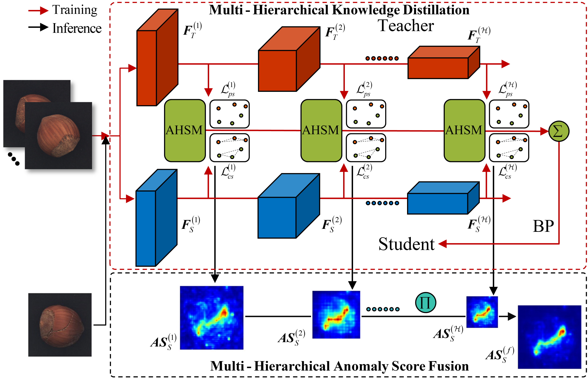

# IKD
Unofficial Re-implementation for [Informative knowledge distillation for image anomaly segmentation](https://www.sciencedirect.com/science/article/abs/pii/S0950705122004038#:~:text=In%20unsupervised%20image%20anomaly%20segmentation%2C%20knowledge%20distillation%20is,the%20student%20and%20teacher%20networks%20indicate%20anomaly%20scores.)

# Description

Các phương pháp phân đoạn bất định dựa trên giảng dạy kiến thức đã được phát triển gần đây và đã cho thấy hiệu suất phân đoạn vượt trội. Tuy nhiên, ít chú ý đã được đến vấn đề quá khớp gây ra bởi sự không nhất quán giữa khả năng của mạng neural và lượng kiến thức trong kế hoạch này. Nghiên cứu này đề xuất một phương pháp mới gọi là giảng dạy kiến thức có tính thông tin (IKD) để giải quyết vấn đề quá khớp bằng cách truyền dạy kiến thức có tính thông tin và cung cấp một tín hiệu giám sát mạnh mẽ. Kỹ thuật, một phương pháp mất mát tương đồng ngữ cảnh mới được đề xuất để bắt được thông tin ngữ cảnh từ các khối dữ liệu bình thường. Ngoài ra, một phương pháp khai thác mẫu khó thích ứng mới được đề xuất để khuyến khích sự chú ý hơn đối với các mẫu khó với thông tin có giá trị. Với IKD, kiến thức có tính thông tin có thể được truyền dạy để giải quyết hiệu quả vấn đề quá khớp và hiệu suất có thể được tăng lên. Phương pháp được đề xuất đạt được kết quả tốt hơn trên một số loại dữ liệu trên bộ dữ liệu MVTec AD nổi tiếng hơn so với các phương pháp tiên tiến nhất về AU-ROC, đạt tổng thể 97,81% trong 15 loại. Các thí nghiệm toàn diện về phân tích đã được thực hiện để chứng minh tính hiệu quả của IKD trong giảm thiểu vấn đề quá khớp.

# Environments

```
einops
kornia
torchmetrics==0.10.3
timm
```


# Process

## 1. Dataset

- [mvtecdataset](https://github.com/pntrungbk15/TNVision/blob/main/task/anomaly/unsupervised/data/dataset.py)


## 2. Model Process 

- [model](https://github.com/pntrungbk15/TNVision/blob/main/task/anomaly/unsupervised/models/ikd/model/ikd.py)

<p align='center'>
    
</p>

# Run

```bash
python main.py --task_type anomaly --model_type unsupervised --model_name ikd --yaml_config configs/anomaly/unsupervised/ikd/bottle.yaml
```

## Demo

### zipper
<p align="left">
  
</p>

### wood
<p align="left">
  
</p>

### transistor
<p align="left">
  
</p>

### toothbrush
<p align="left">
  
</p>

### tile
<p align="left">
  
</p>

### screw
<p align="left">
  
</p>

### pill
<p align="left">
  
</p>

### metal_nut
<p align="left">
  
</p>

### leather
<p align="left">
  
</p>

### hazelnut
<p align="left">
  
</p>

### grid
<p align="left">
  
</p>

### carpet
<p align="left">
  
</p>

### capsule
<p align="left">
  
</p>

### cable
<p align="left">
  
</p>

### bottle
<p align="left">
  
</p>

# Results

### Image-Level AUC

|                          |  Avg  | Carpet | Grid  | Leather | Tile  | Wood  | Bottle | Cable | Capsule | Hazelnut | Metal Nut | Pill  | Screw | Toothbrush | Transistor | Zipper |
| ------------------------ | :---: | :----: | :---: | :-----: | :---: | :---: | :----: | :---: | :-----: | :------: | :-------: | :---: | :---: | :--------: | :--------: | :----: |
|  | 0.000 | 0.000  | 0.000 |  0.000  | 0.000 | 0.000 | 0.000  | 0.000 |  0.000  |  0.000   |   0.000   | 0.000 | 0.000 |   0.000    |   0.000    | 0.000  |

### Pixel-Level AUC

|                          |  Avg  | Carpet | Grid  | Leather | Tile  | Wood  | Bottle | Cable | Capsule | Hazelnut | Metal Nut | Pill  | Screw | Toothbrush | Transistor | Zipper |
| ------------------------ | :---: | :----: | :---: | :-----: | :---: | :---: | :----: | :---: | :-----: | :------: | :-------: | :---: | :---: | :--------: | :--------: | :----: |
|  | 0.000 | 0.000  | 0.000 |  0.000  | 0.000 | 0.000 | 0.000  | 0.000 |  0.000  |  0.000   |   0.000   | 0.000 | 0.000 |   0.000    |   0.000    | 0.000  |

### Pixel F1 Score

|                          |  Avg  | Carpet | Grid  | Leather | Tile  | Wood  | Bottle | Cable | Capsule | Hazelnut | Metal Nut | Pill  | Screw | Toothbrush | Transistor | Zipper |
| ------------------------ | :---: | :----: | :---: | :-----: | :---: | :---: | :----: | :---: | :-----: | :------: | :-------: | :---: | :---: | :--------: | :--------: | :----: |
|  | 0.000 | 0.000  | 0.000 |  0.000  | 0.000 | 0.000 | 0.000  | 0.000 |  0.000  |  0.000   |   0.000   | 0.000 | 0.000 |   0.000    |   0.000    | 0.000  |