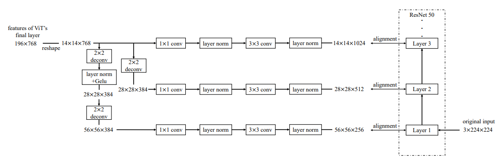

# MMR
Unofficial Re-implementation for [Industrial Anomaly Detection with Domain Shift: A Real-world Dataset and Masked Multi-scale Reconstruction](https://arxiv.org/pdf/2304.02216v1.pdf)

## Description

Phát hiện bất thường trong công nghiệp (IAD) là rất quan trọng để tự động hóa công đoạn kiểm tra chất lượng công nghiệp. Sự đa dạng của các bộ dữ liệu là nền tảng để phát triển các thuật toán IAD toàn diện. Các bộ dữ liệu IAD hiện có tập trung vào sự đa dạng của các danh mục dữ liệu, bỏ qua sự đa dạng của các lĩnh vực khác nhau trong cùng một danh mục dữ liệu. Trong bài báo này, để san cho vấn đề này, chúng tôi đề xuất bộ dữ liệu Phát hiện Bất thường trên Lưỡi Dao Động Cơ Phản Lực (AeBAD), gồm hai tập dữ liệu con: tập dữ liệu lưỡi dao đơn và tập dữ liệu phát hiện bất thường từ video của các lưỡi dao. So với các bộ dữ liệu hiện có, AeBAD có hai đặc điểm sau đây: 1.) Các mẫu mục tiêu không được căn chỉnh và có kích thước khác nhau. 2.) Có một sự chuyển đổi miền giữa phân phối của các mẫu bình thường trong tập kiểm tra và tập huấn luyện, trong đó sự chuyển đổi miền chủ yếu do sự thay đổi về ánh sáng và góc nhìn. Dựa trên bộ dữ liệu này, chúng tôi quan sát thấy các phương pháp IAD tiên tiến nhất hiện nay (SOTA) có nhược điểm khi miền của các mẫu bình thường trong tập kiểm tra trải qua một sự chuyển đổi. Để giải quyết vấn đề này, chúng tôi đề xuất một phương pháp mới gọi là phục hồi đa tỷ lệ với mặt nạ (MMR), giúp tăng khả năng của mô hình trong việc suy ra nguyên nhân giữa các mảnh ghép trong các mẫu bình thường thông qua một nhiệm vụ phục hồi được che giấu. MMR đạt được hiệu suất vượt trội so với các phương pháp SOTA trên bộ dữ liệu AeBAD. Hơn nữa, MMR đạt được hiệu suất cạnh tranh với các phương pháp SOTA trong việc phát hiện bất thường của các loại khác nhau trên bộ dữ liệu MVTec AD.

# Environments

```
einops
kornia
torchmetrics==0.10.3
timm
```


# Process

## 1. Dataset

- [mvtecdataset](https://github.com/pntrungbk15/TNVision/blob/main/task/anomaly/unsupervised/data/dataset.py)


## 2. Model Process 

- [model](https://github.com/pntrungbk15/TNVision/blob/main/task/anomaly/unsupervised/models/mmr/model/mmr.py)

<p align='center'>
    
</p>


# Run

```bash
python main.py --task_type anomaly --model_type unsupervised --model_name mmr --yaml_config configs/anomaly/unsupervised/mmr/bottle.yaml
```

## Demo

### zipper
<p align="left">
  
</p>

### wood
<p align="left">
  
</p>

### transistor
<p align="left">
  
</p>

### toothbrush
<p align="left">
  
</p>

### tile
<p align="left">
  
</p>

### screw
<p align="left">
  
</p>

### pill
<p align="left">
  
</p>

### metal_nut
<p align="left">
  
</p>

### leather
<p align="left">
  
</p>

### hazelnut
<p align="left">
  
</p>

### grid
<p align="left">
  
</p>

### carpet
<p align="left">
  
</p>

### capsule
<p align="left">
  
</p>

### cable
<p align="left">
  
</p>

### bottle
<p align="left">
  
</p>

# Results

### Image-Level AUC

|                          |  Avg  | Carpet | Grid  | Leather | Tile  | Wood  | Bottle | Cable | Capsule | Hazelnut | Metal Nut | Pill  | Screw | Toothbrush | Transistor | Zipper |
| ------------------------ | :---: | :----: | :---: | :-----: | :---: | :---: | :----: | :---: | :-----: | :------: | :-------: | :---: | :---: | :--------: | :--------: | :----: |
|  | 0.000 | 0.000  | 0.000 |  0.000  | 0.000 | 0.000 | 0.000  | 0.000 |  0.000  |  0.000   |   0.000   | 0.000 | 0.000 |   0.000    |   0.000    | 0.000  |

### Pixel-Level AUC

|                          |  Avg  | Carpet | Grid  | Leather | Tile  | Wood  | Bottle | Cable | Capsule | Hazelnut | Metal Nut | Pill  | Screw | Toothbrush | Transistor | Zipper |
| ------------------------ | :---: | :----: | :---: | :-----: | :---: | :---: | :----: | :---: | :-----: | :------: | :-------: | :---: | :---: | :--------: | :--------: | :----: |
|  | 0.000 | 0.000  | 0.000 |  0.000  | 0.000 | 0.000 | 0.000  | 0.000 |  0.000  |  0.000   |   0.000   | 0.000 | 0.000 |   0.000    |   0.000    | 0.000  |

### Pixel F1 Score

|                          |  Avg  | Carpet | Grid  | Leather | Tile  | Wood  | Bottle | Cable | Capsule | Hazelnut | Metal Nut | Pill  | Screw | Toothbrush | Transistor | Zipper |
| ------------------------ | :---: | :----: | :---: | :-----: | :---: | :---: | :----: | :---: | :-----: | :------: | :-------: | :---: | :---: | :--------: | :--------: | :----: |
|  | 0.000 | 0.000  | 0.000 |  0.000  | 0.000 | 0.000 | 0.000  | 0.000 |  0.000  |  0.000   |   0.000   | 0.000 | 0.000 |   0.000    |   0.000    | 0.000  |
