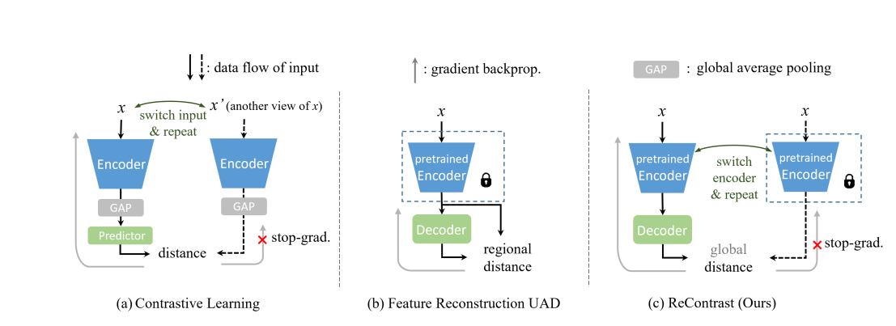

# ReContrast
Unofficial Re-implementation for [ReContrast: Domain-Specific Anomaly Detection via Contrastive Reconstruction](https://arxiv.org/pdf/2103.04257.pdf)

## Description

Hầu hết các phương pháp phát hiện bất thường không giám sát (UAD) tiên tiến dựa trên việc xây dựng các biểu diễn đặc trưng từ các mạng mã hóa đã được huấn luyện trước trên các tập dữ liệu quy mô lớn, ví dụ như ImageNet. Tuy nhiên, các đặc trưng được trích xuất từ các mạng mã hóa này, được mượn từ miền ảnh tự nhiên, có ít tương đồng với các đặc trưng cần thiết trong lĩnh vực UAD mục tiêu, như kiểm tra công nghiệp và hình ảnh y khoa. Trong bài báo này, chúng tôi đề xuất một phương pháp UAD hiểu biết mới, được gọi là ReContrast, tối ưu toàn bộ mạng để giảm thiểu sự thiên vị đối với miền ảnh đã được huấn luyện trước và điều chỉnh mạng trong miền mục tiêu. Chúng tôi bắt đầu với một phương pháp tái tạo đặc trưng để phát hiện bất thường từ các sai số. Cơ bản, các yếu tố của học đối nghịch được nhúng một cách tinh tế vào quá trình tái tạo đặc trưng để ngăn mạng bị không ổn định, suy giảm mẫu và tạo ra các đường tắt giống nhau, đồng thời tối ưu hóa cả bộ mã hóa và giải mã trên miền mục tiêu. Để chứng minh khả năng chuyển giao trên các miền ảnh khác nhau, chúng tôi tiến hành các thử nghiệm đáng kể trên hai tập dữ liệu thử nghiệm phát hiện lỗi công nghiệp phổ biến và ba nhiệm vụ UAD hình ảnh y khoa, cho thấy sự ưu superior của chúng tôi so với các phương pháp tiên tiến hiện tại.

# Environments

```
einops
kornia
torchmetrics==0.10.3
timm
```


# Process

## 1. Dataset

- [mvtecdataset](https://github.com/pntrungbk15/TNVision/blob/main/task/anomaly/unsupervised/data/dataset.py)


## 2. Model Process 

- [model](https://github.com/pntrungbk15/TNVision/blob/main/task/anomaly/unsupervised/models/recontrast/model/recontrast.py)

<p align='center'>
    
</p>


# Run

```bash
python main.py --task_type anomaly --model_type unsupervised --model_name recontrast --yaml_config configs/anomaly/unsupervised/recontrast/bottle.yaml
```

## Demo

### zipper
<p align="left">
  
</p>

### wood
<p align="left">
  
</p>

### transistor
<p align="left">
  
</p>

### toothbrush
<p align="left">
  
</p>

### tile
<p align="left">
  
</p>

### screw
<p align="left">
  
</p>

### pill
<p align="left">
  
</p>

### metal_nut
<p align="left">
  
</p>

### leather
<p align="left">
  
</p>

### hazelnut
<p align="left">
  
</p>

### grid
<p align="left">
  
</p>

### carpet
<p align="left">
  
</p>

### capsule
<p align="left">
  
</p>

### cable
<p align="left">
  
</p>

### bottle
<p align="left">
  
</p>

# Results

### Image-Level AUC

|                          |  Avg  | Carpet | Grid  | Leather | Tile  | Wood  | Bottle | Cable | Capsule | Hazelnut | Metal Nut | Pill  | Screw | Toothbrush | Transistor | Zipper |
| ------------------------ | :---: | :----: | :---: | :-----: | :---: | :---: | :----: | :---: | :-----: | :------: | :-------: | :---: | :---: | :--------: | :--------: | :----: |
|  | 0.000 | 0.000  | 0.000 |  0.000  | 0.000 | 0.000 | 0.000  | 0.000 |  0.000  |  0.000   |   0.000   | 0.000 | 0.000 |   0.000    |   0.000    | 0.000  |

### Pixel-Level AUC

|                          |  Avg  | Carpet | Grid  | Leather | Tile  | Wood  | Bottle | Cable | Capsule | Hazelnut | Metal Nut | Pill  | Screw | Toothbrush | Transistor | Zipper |
| ------------------------ | :---: | :----: | :---: | :-----: | :---: | :---: | :----: | :---: | :-----: | :------: | :-------: | :---: | :---: | :--------: | :--------: | :----: |
|  | 0.000 | 0.000  | 0.000 |  0.000  | 0.000 | 0.000 | 0.000  | 0.000 |  0.000  |  0.000   |   0.000   | 0.000 | 0.000 |   0.000    |   0.000    | 0.000  |

### Pixel F1 Score

|                          |  Avg  | Carpet | Grid  | Leather | Tile  | Wood  | Bottle | Cable | Capsule | Hazelnut | Metal Nut | Pill  | Screw | Toothbrush | Transistor | Zipper |
| ------------------------ | :---: | :----: | :---: | :-----: | :---: | :---: | :----: | :---: | :-----: | :------: | :-------: | :---: | :---: | :--------: | :--------: | :----: |
|  | 0.000 | 0.000  | 0.000 |  0.000  | 0.000 | 0.000 | 0.000  | 0.000 |  0.000  |  0.000   |   0.000   | 0.000 | 0.000 |   0.000    |   0.000    | 0.000  |