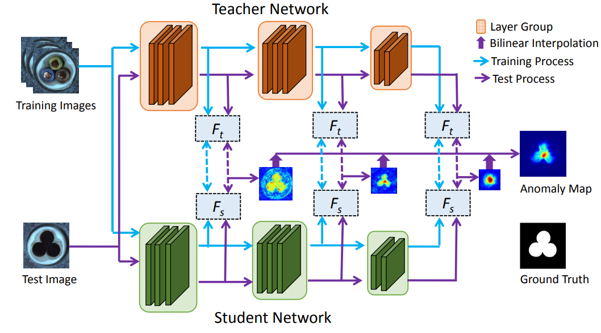

# STFPM
Unofficial Re-implementation for [Student-Teacher Feature Pyramid Matching for Unsupervised Anomaly Detection](https://arxiv.org/pdf/2103.04257.pdf)

## Description

Phát hiện bất thường là một nhiệm vụ thách thức và thường được định nghĩa là một vấn đề học một lớp cho tính bất ngờ của những đối tượng bất thường. Bài báo này đề xuất một phương pháp đơn giản nhưng mạnh mẽ cho vấn đề này, được thực hiện trong khung công tác học sinh-giáo viên với những lợi điểm của nó nhưng mở rộng đáng kể về cả độ chính xác và hiệu quả. Cho một mô hình mạnh mẽ được tiền huấn luyện trên phân loại hình ảnh làm giáo viên, chúng tôi giải đắp tri thức vào một mạng học sinh duy nhất với cấu trúc giống hệt nhau để học phân phối của các hình ảnh không có bất thường và quá trình chuyển này giữ lại những đầu mối quan trọng nhất càng nhiều càng tốt. Hơn nữa, chúng tôi tích hợp chiến lược đối sánh đa tỷ lệ vào khung công tác, và đối sánh đa cấp giúp cho mạng học sinh nhận được một sự pha trộn của tri thức đa cấp từ đỉnh tính năng dưới sự giám sát tốt hơn, cho phép phát hiện các bất thường có kích thước khác nhau. Sự khác biệt giữa các kim tự tháp đặc trưng được sinh ra bởi hai mạng được sử dụng như một hàm điểm số chỉ ra xác suất xảy ra của sự bất thường. Nhờ các hoạt động này, phương pháp của chúng tôi đạt được độ chính xác và tốc độ phát hiện bất thường cấp pixel cao. Kết quả cạnh tranh rất tốt được đạt trên tập dữ liệu phát hiện bất thường MVTec, vượt trội hơn so với những phương pháp tiên tiến hiện nay.

# Environments

```
einops
kornia
torchmetrics==0.10.3
timm
```


# Process

## 1. Dataset

- [mvtecdataset](https://github.com/pntrungbk15/TNVision/blob/main/task/anomaly/unsupervised/data/dataset.py)


## 2. Model Process 

- [model](https://github.com/pntrungbk15/TNVision/blob/main/task/anomaly/unsupervised/models/stfpm/model/stfpm.py)

<p align='center'>
    
</p>


# Run

```bash
python main.py --task_type anomaly --model_type unsupervised --model_name stfpm --yaml_config configs/anomaly/unsupervised/stfpm/bottle.yaml
```

## Demo

### zipper
<p align="left">
  
</p>

### wood
<p align="left">
  
</p>

### transistor
<p align="left">
  
</p>

### toothbrush
<p align="left">
  
</p>

### tile
<p align="left">
  
</p>

### screw
<p align="left">
  
</p>

### pill
<p align="left">
  
</p>

### metal_nut
<p align="left">
  
</p>

### leather
<p align="left">
  
</p>

### hazelnut
<p align="left">
  
</p>

### grid
<p align="left">
  
</p>

### carpet
<p align="left">
  
</p>

### capsule
<p align="left">
  
</p>

### cable
<p align="left">
  
</p>

### bottle
<p align="left">
  
</p>

# Results

### Image-Level AUC

|                          |  Avg  | Carpet | Grid  | Leather | Tile  | Wood  | Bottle | Cable | Capsule | Hazelnut | Metal Nut | Pill  | Screw | Toothbrush | Transistor | Zipper |
| ------------------------ | :---: | :----: | :---: | :-----: | :---: | :---: | :----: | :---: | :-----: | :------: | :-------: | :---: | :---: | :--------: | :--------: | :----: |
|  | 0.000 | 0.000  | 0.000 |  0.000  | 0.000 | 0.000 | 0.000  | 0.000 |  0.000  |  0.000   |   0.000   | 0.000 | 0.000 |   0.000    |   0.000    | 0.000  |

### Pixel-Level AUC

|                          |  Avg  | Carpet | Grid  | Leather | Tile  | Wood  | Bottle | Cable | Capsule | Hazelnut | Metal Nut | Pill  | Screw | Toothbrush | Transistor | Zipper |
| ------------------------ | :---: | :----: | :---: | :-----: | :---: | :---: | :----: | :---: | :-----: | :------: | :-------: | :---: | :---: | :--------: | :--------: | :----: |
|  | 0.000 | 0.000  | 0.000 |  0.000  | 0.000 | 0.000 | 0.000  | 0.000 |  0.000  |  0.000   |   0.000   | 0.000 | 0.000 |   0.000    |   0.000    | 0.000  |

### Pixel F1 Score

|                          |  Avg  | Carpet | Grid  | Leather | Tile  | Wood  | Bottle | Cable | Capsule | Hazelnut | Metal Nut | Pill  | Screw | Toothbrush | Transistor | Zipper |
| ------------------------ | :---: | :----: | :---: | :-----: | :---: | :---: | :----: | :---: | :-----: | :------: | :-------: | :---: | :---: | :--------: | :--------: | :----: |
|  | 0.000 | 0.000  | 0.000 |  0.000  | 0.000 | 0.000 | 0.000  | 0.000 |  0.000  |  0.000   |   0.000   | 0.000 | 0.000 |   0.000    |   0.000    | 0.000  |