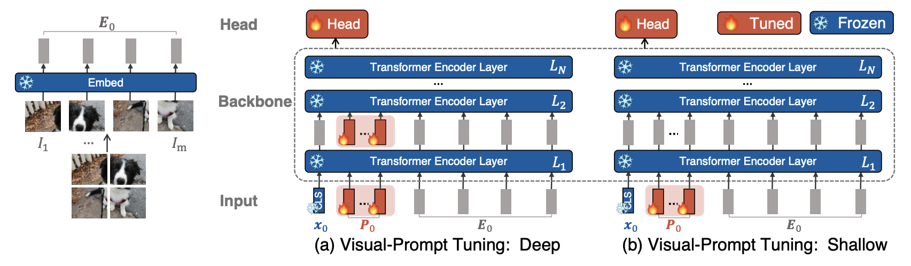

# VPT
Unofficial Re-implementation for [Visual Prompt Tuning](https://arxiv.org/pdf/2203.12119.pdf)

# Description

Phương pháp hiện tại để thích ứng các mô hình được huấn luyện trước bao gồm cập nhật tất cả các tham số của mạng gốc, tức là tinh chỉnh toàn bộ mô hình.
Bài báo này giới thiệu Visual Prompt Tuning (VPT) như một phương pháp thay thế hiệu quả và hiệu quả cho việc tinh chỉnh mô hình Transformer quy mô lớn trong lĩnh vực thị giác. Lấy cảm hứng từ những tiến bộ gần đây trong việc tinh chỉnh mô hình ngôn ngữ lớn một cách hiệu quả, VPT chỉ giới thiệu một lượng nhỏ (ít hơn 1% số tham số của mô hình) tham số có thể huấn luyện trong không gian đầu vào trong khi giữ nguyên phần cốt lõi của mô hình. Qua các thử nghiệm đa dạng trên nhiều nhiệm vụ nhận dạng phụ thuộc, chúng tôi cho thấy VPT đạt được những cải tiến đáng kể về hiệu suất so với các giao thức tinh chỉnh tiết kiệm tham số khác. Quan trọng nhất, VPT thậm chí vượt trội hơn so với việc tinh chỉnh toàn bộ mô hình trong nhiều trường hợp về khả năng và quy mô dữ liệu huấn luyện, đồng thời giảm thiểu chi phí lưu trữ cho mỗi nhiệm vụ.

# Environments

```
```

# Process
## 1. Dataset

- [Classify dataset](https://github.com/pntrungbk15/TNVision/blob/main/tasks/classify/supervised/data/dataset.py)


## 2. Model Process 

- [model](https://github.com/pntrungbk15/TNVision/blob/main/tasks/classify/supervised/models/vpt/model/vpt.py)

<p align='center'>
    
</p>

# Run

```bash
python main.py --task_type classify --model_type supervised --model_name vpt --yaml_config configs/classify/supervised/vpt/garbage.yaml
```

## Demo

### Garbage
<p align="left">
  
</p>


# Results

TBD

|    | target     |   ACCURACY 
|---:|:-----------|--------------
|  0 | garbage    |         97.23  
