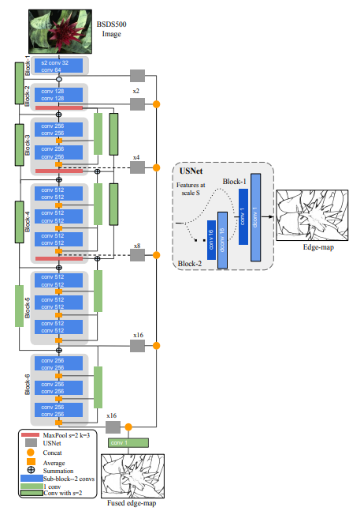

# DexiNed
Unofficial Re-implementation for [Dense Extreme Inception Network for Edge Detection](https://arxiv.org/pdf/2112.02250.pdf)

# Description

Đây là một đề xuất nghiên cứu, vui lòng truy cập tạp chí Nhận dạng Mẫu trên Sciencedirect để đọc bản tóm tắt đầy đủ. Phát hiện cạnh là cơ sở của nhiều ứng dụng thị giác máy tính. Công nghệ hiện đại chủ yếu dựa trên học sâu với hai yếu tố quyết định: nội dung của tập dữ liệu và kiến trúc của mạng nơ-ron. Hầu hết các tập dữ liệu công khai hiện có không được tổ chức tốt cho nhiệm vụ phát hiện cạnh. Ở đây, chúng tôi đề xuất một giải pháp cho hạn chế này. Đầu tiên, chúng tôi lập luận rằng cạnh, đường viền và biên giới, mặc dù có sự chồng chéo, là ba đặc trưng hình ảnh khác biệt đòi hỏi các tập dữ liệu thử nghiệm riêng biệt. Vì vậy, chúng tôi trình bày một tập dữ liệu mới về cạnh. Thứ hai, chúng tôi đề xuất một kiến trúc mới, gọi là Mạng Inception Cực Đại Dày Đặc cho Phát hiện Cạnh (DexiNed), có thể được đào tạo từ đầu mà không cần trọng số được đào tạo trước. DexiNed vượt trội hơn các thuật toán khác trên tập dữ liệu được trình bày. Nó cũng có khả năng tổng quát hóa tốt trên các tập dữ liệu khác mà không cần điều chỉnh lại. Chất lượng cao hơn của DexiNed cũng rõ ràng về mặt thị giác nhờ vào cạnh sắc nét và tinh tế hơn mà nó đầu ra.


# Environments

```
```


# Process

## 1. Dataset

- [edgedataset](https://github.com/pntrungbk15/TNVision/blob/main/task/edgedetection/supervised/data/dataset.py)


## 2. Model Process 

- [model](https://github.com/pntrungbk15/TNVision/blob/main/task/edgedetection/supervised/models/dexined/model/dexined.py)

<p align='center'>
    
</p>

# Run

```bash
python main.py --task_type edgedetection --model_type supervised  --model_name dexined --yaml_config configs/edgedetection/supervised/dexined/bsds.yaml
```

## Demo

### BDS500
<p align="left">
  
</p>

# Results

TBD

|    | target     |   AUROC-image |   AUROC-pixel |   AUPRO-pixel |
|---:|:-----------|--------------:|--------------:|--------------:|
|  0 | bottle     |         100   |         98.70 |         96.02 |
|  1 | capsule    |         94.80 |         98.20 |         94.10 |
|  2 | wood       |         99.82 |         97.12 |         93.41 |
|  3 | pill       |         97.25 |         98.21 |         95.30 |
|  4 | leather    |         100   |         99.31 |         98.83 |
|  5 | hazelnut   |         98.79 |         97.31 |         96.67 |
|    | **Average**    |         98.44 |         98.14 |         95.72 |
