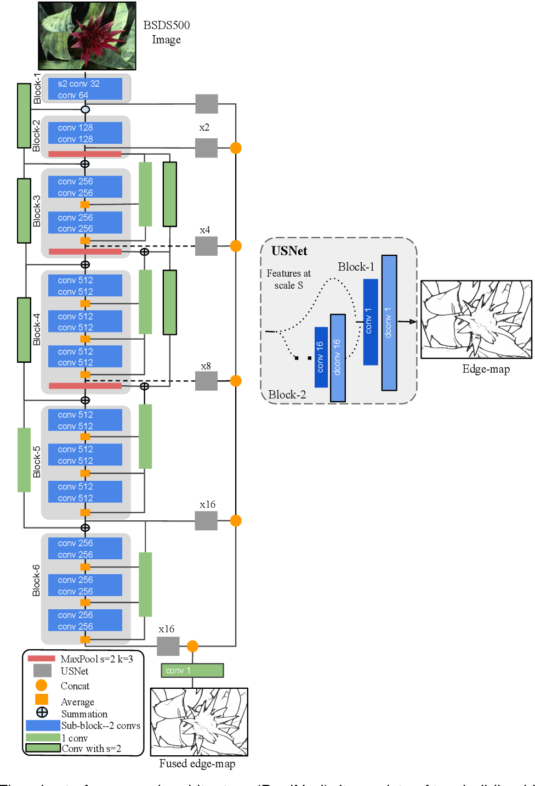

# LDC
Unofficial Re-implementation for [LDC: Lightweight Dense CNN for Edge Detection](https://ieeexplore.ieee.org/document/9807316)

# Description

Bài báo này trình bày một mạng nơ-ron Lightweight Dense Convolutional (LDC) cho phát hiện cạnh. Kiến trúc được đề xuất là một sự thích nghi của hai phương pháp hiện đại nhưng chỉ cần dưới 4% số lượng tham số so với những phương pháp này. Kiến trúc được đề xuất tạo ra các bản đồ cạnh mảnh và đạt điểm số cao nhất (tức ODS) so với các mô hình nhẹ (mô hình có ít hơn 1 triệu tham số) và đạt hiệu suất tương tự so với các kiến trúc nặng (mô hình có khoảng 35 triệu tham số). Cả kết quả định lượng và định tính và so sánh với các mô hình tiên tiến, sử dụng các tập dữ liệu phát hiện cạnh khác nhau, được cung cấp. LDC được đề xuất không sử dụng trọng số được huấn luyện trước và yêu cầu cài đặt siêu tham số đơn giản.


# Environments

```
```


# Process

## 1. Dataset

- [edgedataset](https://github.com/pntrungbk15/TNVision/blob/main/task/edgedetection/supervised/data/dataset.py)


## 2. Model Process 

- [model](https://github.com/pntrungbk15/TNVision/blob/main/task/edgedetection/supervised/models/ldc/model/ldc.py)

<p align='center'>
    
</p>

# Run

```bash
python main.py --task_type edgedetection --model_type supervised --model_name ldc --yaml_config configs/edgedetection/supervised/ldc/bsds.yaml
```

## Demo

### BDS500
<p align="left">
  
</p>

# Results

TBD

|    | target     |   AUROC-image |   AUROC-pixel |   AUPRO-pixel |
|---:|:-----------|--------------:|--------------:|--------------:|
|  0 | bottle     |         100   |         98.70 |         96.02 |
|  1 | capsule    |         94.80 |         98.20 |         94.10 |
|  2 | wood       |         99.82 |         97.12 |         93.41 |
|  3 | pill       |         97.25 |         98.21 |         95.30 |
|  4 | leather    |         100   |         99.31 |         98.83 |
|  5 | hazelnut   |         98.79 |         97.31 |         96.67 |
|    | **Average**    |         98.44 |         98.14 |         95.72 |
