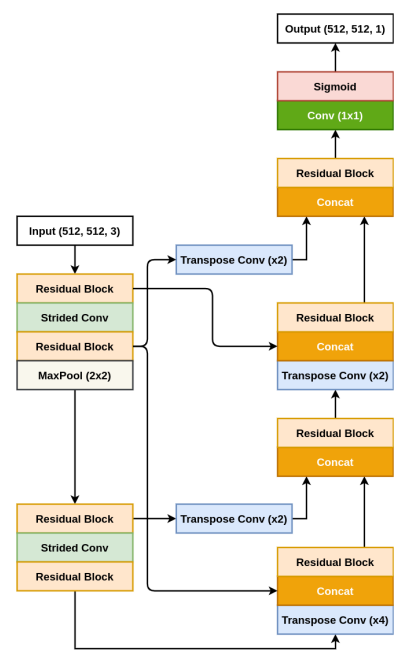

# ColonSegNet
Unofficial Re-implementation for [Real-Time Polyp Detection, Localization and Segmentation in Colonoscopy Using Deep Learning](https://arxiv.org/pdf/2011.07631.pdf)

# Description

Các phương pháp hỗ trợ máy tính trong việc phát hiện, xác định vị trí và phân đoạn đóng vai trò quan trọng trong việc cải thiện các thủ tục khảo sát đại tràng. Mặc dù đã có nhiều phương pháp được xây dựng để giải quyết việc phát hiện và phân đoạn tự động của khối u đại tràng, nhưng việc đánh giá các phương pháp tối tân vẫn là một vấn đề mở. Điều này là do số lượng các phương pháp thị giác máy tính được nghiên cứu và áp dụng trên các tập dữ liệu khối u đại tràng ngày càng tăng. Việc đánh giá các phương pháp mới có thể cung cấp hướng đi cho sự phát triển các nhiệm vụ phát hiện và phân đoạn tự động của khối u đại tràng. Hơn nữa, nó đảm bảo rằng các kết quả được sản xuất trong cộng đồng là có thể tái sản xuất và cung cấp một so sánh hợp lý về các phương pháp được phát triển. Trong bài báo này, chúng tôi đánh giá một số phương pháp tối tân gần đây bằng cách sử dụng Kvasir-SEG, một tập dữ liệu mở truy cập về hình ảnh khám nghiệm đại tràng để phát hiện, xác định vị trí và phân đoạn khối u, đánh giá cả độ chính xác và tốc độ của các phương pháp. Trong khi hầu hết các phương pháp trong tài liệu có hiệu suất cạnh tranh về độ chính xác, chúng tôi cho thấy rằng ColonSegNet được đề xuất đạt được sự cân đối tốt hơn giữa độ chính xác trung bình 0,8000 và trung bình IoU 0,8100, và tốc độ nhanh nhất là 180 khung hình mỗi giây cho nhiệm vụ phát hiện và xác định vị trí. Tương tự, ColonSegNet được đề xuất đạt được hệ số Dice cạnh tranh 0,8206 và tốc độ trung bình tốt nhất là 182,38 khung hình mỗi giây cho nhiệm vụ phân đoạn.

# Environments

```
timm
```


# Process

## 1. Dataset

- [segmentdataset](https://github.com/pntrungbk15/TNVision/blob/main/tasks/segmentation/supervised/pytorch/data/dataset.py)


## 2. Model Process 

- [model](https://github.com/pntrungbk15/TNVision/blob/main/tasks/segmentation/supervised/pytorch/models/colonsegnet/model/colonsegnet.py)

<p align='center'>
    
</p>

# Run

```bash
python main.py --task_type segment --model_type supervised --model_name colonsegnet --yaml_config configs/segment/supervised/colonsegnet/kvasir.yaml
```

## Demo

### Kvasir
<p align="left">
  
</p>

### Bkai
<p align="left">
  
</p>

# Results

TBD

|    | target     | F1            |  
|---:|:-----------|--------------:|
|  0 | kvasir     |         63.71 |
|  1 | bkai       |         64.54 |
|    | **Average**    |         64.13 |