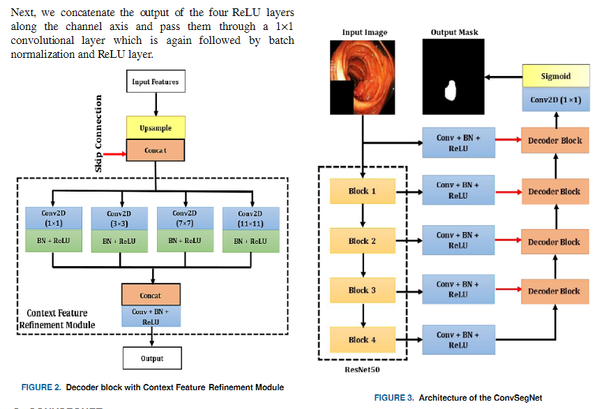

# ConvSeg
Unofficial Re-implementation for [ConvSegNet: Automated Polyp Segmentation From Colonoscopy Using Context Feature Refinement With Multiple Convolutional Kernel Sizes](https://www.researchgate.net/publication/368520240_ConvSegNet_Automated_Polyp_Segmentation_from_Colonoscopy_using_Context_Feature_Refinement_with_Multiple_Convolutional_Kernel_Sizes)

# Description

Ung thư đại trực tràng (CRC) là nguyên nhân thứ hai gây tử vong liên quan đến ung thư trên toàn thế giới. Cắt polyp khi nội soi giúp
giảm tỷ lệ tử vong và tỷ lệ mắc bệnh cho CRC. Được hỗ trợ bởi học sâu, hệ thống chẩn đoán hỗ trợ máy tính (CAD) có thể phát hiện các vùng trong đại tràng bị các bác sĩ bỏ qua trong quá trình nội soi. Thiếu độ chính xác cao và tốc độ thời gian thực là những trở ngại cần thiết phải vượt qua để thành công tích hợp lâm sàng của các hệ thống như vậy. Trong khi tài liệu tập trung vào việc cải thiện độ chính xác, thông số tốc độ thường bị bỏ qua. Để đáp ứng nhu cầu cấp thiết này, chúng tôi dự định phát triển một kiến ​​trúc dựa trên học sâu theo thời gian thực mới, DilatedSegNet, để thực hiện phân đoạn polyp một cách nhanh chóng. DilatedSegNet là một mạng giải mã-mã hóa sử dụng ResNet50 được đào tạo trước làm bộ mã hóa mà từ đó chúng tôi trích xuất bốn cấp bản đồ đặc trưng. Mỗi trong số các bản đồ tính năng này được chuyển qua một nhóm tích chập mở rộng (DCP) khối. Đầu ra từ các khối DCP được nối và được chuyển qua một loạt bốn khối giải mã dự đoán mặt nạ phân đoạn. Phương pháp đề xuất đạt được tốc độ hoạt động thời gian thực 33,68 khung hình mỗi giây với hệ số xúc xắc trung bình (DSC) là 0,90 và mIoU là 0,83. Ngoài ra, chúng tôi cũng cung cấp bản đồ nhiệt cùng với kết quả định tính cho thấy lời giải thích cho vị trí polyp, làm tăng độ tin cậy của phương pháp. Kết quả trên bộ dữ liệu Kvasir-SEG và BKAI-IGH có sẵn công khai cho thấy rằng DilatedSegNet có thể đưa ra phản hồi theo thời gian thực trong khi vẫn giữ được DSC cao, cho thấy tiềm năng cao để sử dụng các mô hình như vậy trong môi trường lâm sàng thực tế ở tương lai gần.

# Environments

```
timm
```


# Process

## 1. Dataset

- [segmentdataset](https://github.com/pntrungbk15/TNVision/blob/main/tasks/segment/supervised/data/dataset.py)


## 2. Model Process 

- [model](https://github.com/pntrungbk15/TNVision/blob/main/tasks/segment/supervised/models/convseg/model/convseg.py)

<p align='center'>
    
</p>

# Run

```bash
python main.py --task_type segment --model_type supervised --model_name convseg --yaml_config configs/segment/supervised/convseg/kvasir.yaml
```

## Demo

### Kvasir
<p align="left">
  
</p>

### Bkai
<p align="left">
  
</p>

# Results

TBD

|    | target     | F1            |  
|---:|:-----------|--------------:|
|  0 | kvasir     |         86.42 |
|  1 | bkai       |         85.80 |
|    | **Average**    |         86.11 |
