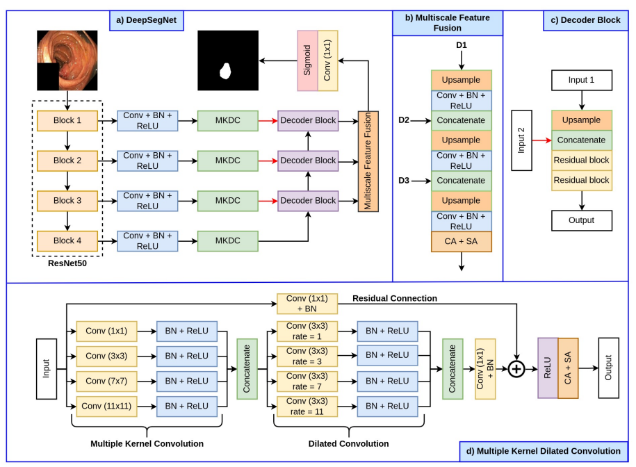

# DeepSegNet
Unofficial Re-implementation for [Automatic Polyp Segmentation with Multiple Kernel Dilated Convolution Network](https://arxiv.org/pdf/2206.06264.pdf)

# Description

Phát hiện và loại bỏ các khối u tiền ung thư thông qua thực quản là kỹ thuật chính để ngăn ngừa ung thư đại trực tràng trên toàn thế giới. Tuy nhiên, tỷ lệ bỏ sót khối u đại trực tràng khác nhau giữa các chuyên gia thực quản. Được biết rằng hệ thống chẩn đoán được hỗ trợ bởi máy tính (CAD) có thể giúp các chuyên gia thực quản phát hiện khối u đại trực tràng và giảm thiểu sự khác biệt giữa các chuyên gia thực quản. Trong nghiên cứu này, chúng tôi giới thiệu một kiến trúc học sâu mới, được đặt tên là MKDCNet, để phân đoạn tự động khối u mạnh mẽ đối với sự thay đổi đáng kể trong phân phối dữ liệu khối u. MKDCNet đơn giản là một mạng thần kinh mã hóa-giải mã sử dụng ResNet50 được tiền huấn luyện như bộ mã hóa và khối đa nhân bản xuyên tâm (MKDC) mới lạ mở rộng phạm vi quan sát để học biểu diễn mạnh mẽ và đa dạng hơn. Các thí nghiệm rộng rãi trên bốn tập dữ liệu khối u được công khai và tập dữ liệu hạt nhân tế bào cho thấy rằng MKDCNet đề xuất vượt trội so với các phương pháp tiên tiến nhất khi được đào tạo và kiểm tra trên cùng một tập dữ liệu và khi kiểm tra trên các tập dữ liệu khối u chưa được quan sát từ phân phối khác nhau. Với kết quả phong phú, chúng tôi đã chứng minh tính ổn định của kiến trúc được đề xuất. Từ quan điểm hiệu suất, thuật toán của chúng tôi có thể xử lý (khoảng 45) khung hình trên giây trên GPU RTX 3090. MKDCNet có thể là một tiêu chuẩn mạnh mẽ cho việc xây dựng hệ thống thời gian thực cho các cuộc thực quản lâm sàng.

# Environments

```
timm
```


# Process

## 1. Dataset

- [segmentdataset](https://github.com/pntrungbk15/TNVision/blob/main/tasks/segmentation/supervised/pytorch/data/dataset.py)


## 2. Model Process 

- [model](https://github.com/pntrungbk15/TNVision/blob/main/tasks/segmentation/supervised/pytorch/models/deepsegnet/model/deepsegnet.py)

<p align='center'>
    
</p>

# Run

```bash
python main.py --task_type segmentation --model_type supervised --framework pytorch --model_name deepsegnet --yaml_config tasks/segmentation/supervised/pytorch/models/deepsegnet/configs/kvasir.yaml
```

## Demo

### Kvasir
<p align="left">
  
</p>

### Bkai
<p align="left">
  
</p>

# Results

TBD

|    | target     | F1            |  
|---:|:-----------|--------------:|
|  0 | kvasir     |         82.68 |
|  1 | bkai       |         83.78 |
|    | **Average**    |         83.23 |