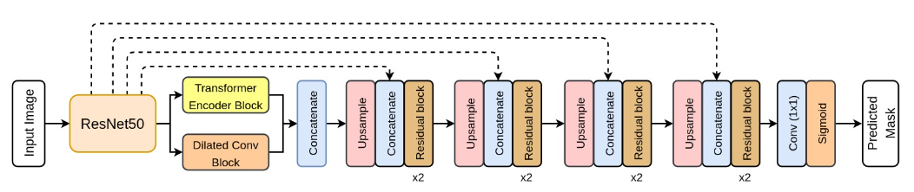

# TResUnet
Unofficial Re-implementation for [TransResU-Net: Transformer based ResU-Net for Real-Time Colonoscopy Polyp Segmentation](https://arxiv.org/pdf/2206.08985.pdf)

# Description

Ung thư đại tràng (CRC) là một trong những nguyên nhân phổ biến nhất của ung thư và tử vong liên quan đến ung thư trên toàn thế giới. Thực hiện sàng lọc ung thư đại tràng đúng thời điểm là chìa khóa để phát hiện sớm. Khảo sát đại tràng là phương pháp chính được sử dụng để chẩn đoán ung thư đại tràng. Tuy nhiên, tỷ lệ bỏ sót của khối u lớn, u lợi sừng và u lợi tiên tiến vẫn còn rất cao. Phát hiện sớm các u lợi ở giai đoạn tiền ung thư có thể giúp giảm tỷ lệ tử vong và gánh nặng kinh tế liên quan đến ung thư đại tràng. Hệ thống hỗ trợ chẩn đoán máy tính (CADx) dựa trên học sâu có thể giúp các chuyên gia tiêu hóa xác định các u lợi có thể bị bỏ sót, từ đó cải thiện tỷ lệ phát hiện u lợi. Ngoài ra, hệ thống CADx có thể chứng minh là một hệ thống hiệu quả về chi phí, cải thiện phòng ngừa ung thư đại tràng trong dài hạn.
Trong nghiên cứu này, chúng tôi đề xuất một kiến trúc dựa trên học sâu để phân đoạn tự động u lợi, được gọi là Transformer ResUNet (TransResU-Net). Kiến trúc đề xuất của chúng tôi được xây dựng trên các khối dư thừa với ResNet-50 làm cột sống và tận dụng cơ chế tự chú ý của bộ biến đổi cũng như các tính năng tích chập giãn nở. Kết quả thử nghiệm của chúng tôi trên hai tập dữ liệu kiểm tra phân đoạn u lợi được công khai cho thấy rằng TransResU-Net đạt được điểm dice rất hứa hẹn và tốc độ thời gian thực. Với hiệu quả cao trong các chỉ số hiệu suất của chúng tôi, chúng tôi kết luận rằng TransResU-Net có thể là một chỉ số mạnh để xây dựng một hệ thống phát hiện u lợi thời gian thực cho chẩn đoán sớm, điều trị và phòng ngừa ung thư đại tràng.

# Environments

```
timm
```


# Process

## 1. Dataset

- [segmentdataset](https://github.com/pntrungbk15/TNVision/blob/main/task/segment/supervised/data/dataset.py)


## 2. Model Process 

- [model](https://github.com/pntrungbk15/TNVision/blob/main/task/segment/supervised/models/tresunet/model/tresunet.py)

<p align='center'>
    
</p>

# Run

```bash
python main.py --task_type segment --model_type supervised --model_name tresunet --yaml_config configs/segment/supervised/tresunet/kvasir.yaml
```

## Demo

### Kvasir
<p align="left">
  
</p>

### Bkai
<p align="left">
  
</p>

# Results

TBD

|    | target     | F1            |  
|---:|:-----------|--------------:|
|  0 | kvasir     |         86.38 |
|  1 | bkai       |         86.20 |
|    | **Average**    |         86.29 |