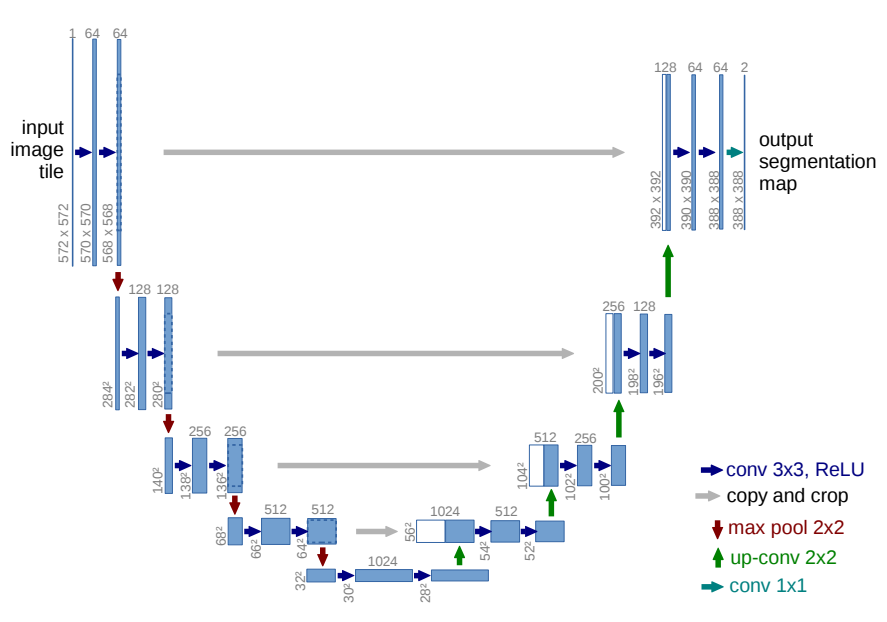

# Unet
Unofficial Re-implementation for [TransResU-Net: Transformer based ResU-Net for Real-Time Colonoscopy Polyp Segmentation](https://arxiv.org/pdf/1505.04597v1.pdf)

# Description

Có sự đồng thuận rằng việc huấn luyện thành công mạng nơ-ron sâu yêu cầu hàng ngàn mẫu huấn luyện được chú thích. Trong bài báo này, chúng tôi giới thiệu một mạng và chiến lược huấn luyện dựa trên việc sử dụng tăng dữ liệu mạnh để sử dụng các mẫu chú thích có sẵn hiệu quả hơn. Kiến trúc bao gồm một đường dẫn thu hẹp để bắt kịp ngữ cảnh và một đường dẫn mở rộng đối xứng cho phép định vị chính xác. Chúng tôi cho thấy rằng một mạng như vậy có thể được huấn luyện end-to-end từ rất ít hình ảnh và vượt qua phương pháp tốt nhất trước đó (một mạng tích chập cửa sổ trượt) trên thử thách ISBI cho phân đoạn cấu trúc thần kinh trong các ngăn xếp vi điện tử. Sử dụng cùng một mạng được huấn luyện trên hình ảnh viển thị ánh sáng (tương phản pha và DIC), chúng tôi đã giành chiến thắng trong thử thách theo dõi tế bào ISBI 2015 ở các danh mục này với khoảng cách lớn. Hơn nữa, mạng rất nhanh. Phân đoạn của một hình ảnh 512x512 chỉ mất ít hơn một giây trên GPU mới nhất.

# Environments

```
```


# Process

## 1. Dataset

- [segmentdataset](https://github.com/pntrungbk15/TNVision/blob/main/tasks/segmentation/supervised/data/dataset.py)


## 2. Model Process 

- [model](https://github.com/pntrungbk15/TNVision/blob/main/tasks/segmentation/supervised/models/unet/model/unet.py)

<p align='center'>
    
</p>

# Run

```bash
python main.py --task_type segment --model_type supervised --model_name unet --yaml_config configs/segment/supervised/unet/kvasir.yaml
```

## Demo

### Kvasir
<p align="left">
  
</p>

### Bkai
<p align="left">
  
</p>

# Results

TBD

|    | target     | F1            |  
|---:|:-----------|--------------:|
|  0 | kvasir     |         86.38 |
|  1 | bkai       |         86.20 |
|    | **Average**    |         86.29 |