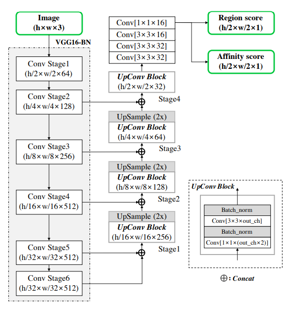

# CRAFT
Unofficial Re-implementation for [Character Region Awareness for Text Detection](https://arxiv.org/pdf/1904.01941v1.pdf)

# Description

Các phương pháp phát hiện văn bản trong cảnh dựa trên mạng
nơ-ron đã xuất hiện gần đây và đã cho thấy kết quả đáng
kỳ vọng. Các phương pháp trước đây được đào tạo với các hộp giới hạn từng từ cứng nhắc có giới hạn trong việc biểu diễn khu vực văn bản theo một hình dạng tùy ý. Trong bài báo này, chúng tôi đề xuất một phương pháp phát hiện văn bản trong cảnh mới để phát hiện hiệu quả khu vực văn bản bằng cách khám phá mỗi ký tự và mối quan hệ giữa các ký tự. Để vượt qua thiếu chú thích cấp ký tự riêng lẻ, khung công việc của chúng tôi tận dụng cả chú thích cấp ký tự cho hình ảnh tổng hợp và các kết quả thực cho hình ảnh thực được thu thập bởi mô hình trung gian đã học. Để ước tính mối quan hệ giữa các ký tự, mạng được đào tạo với biểu diễn mới được đề xuất cho mối quan hệ. Thực nghiệm rộng trên sáu bộ dữ liệu thử nghiệm, bao gồm bộ dữ liệu TotalText và CTW-1500 chứa các văn bản cong nhiều trong ảnh tự nhiên, cho thấy rằng phát hiện văn bản theo cấp ký tự của chúng tôi vượt trội đáng kể so với các công cụ phát hiện tối ưu nhất hiện nay. Theo kết quả, phương pháp đề xuất của chúng tôi đảm bảo tính linh hoạt cao trong việc phát hiện hình ảnh văn bản phức tạp, chẳng hạn như văn bản có hướng tùy ý, cong hoặc biến dạng.

# Environments

```
shapely
```


# Process

## 1. Dataset

- [craftdataset](https://github.com/pntrungbk15/TNVision/blob/main/task/textdetection/weaklysupervised/models/craft/data/utils/craftbasedataset.py)


## 2. Model Process 

- [model](https://github.com/pntrungbk15/TNVision/blob/main/task/textdetection/weaklysupervised/models/craft/model/craft.py)

<p align='center'>
    
</p>

# Run

## Synth Model Train 

```bash
python main.py --task_type textdetection --model_type weaklysupervised --model_name craft --yaml_config configs/textdetection/weaklysupervised/craft/synth.yaml
```

## Synth-Icdar13 Model Train 

```bash
python main.py --task_type textdetection --model_type weaklysupervised --model_name craft --yaml_config configs/textdetection/weaklysupervised/craft/icdar13.yaml
```

## Synth-Icdar15 Model Train 

```bash
python main.py --task_type textdetection --model_type weaklysupervised --model_name craft --yaml_config configs/textdetection/weaklysupervised/craft/icdar15.yaml
```

## Synth-Icdar17 Model Train 

```bash
python main.py --task_type textdetection --model_type weaklysupervised --model_name craft --yaml_config configs/textdetection/weaklysupervised/craft/icdar17.yaml
```

## Demo


# Results

TBD

|    | target           |   Hmean       |        Recall |     Precision |
|---:|:-----------------|--------------:|--------------:|--------------:|
|  0 | synth            |         100   |         98.70 |         96.02 |
|  1 | synth-icdar15    |         94.80 |         98.20 |         94.10 |
